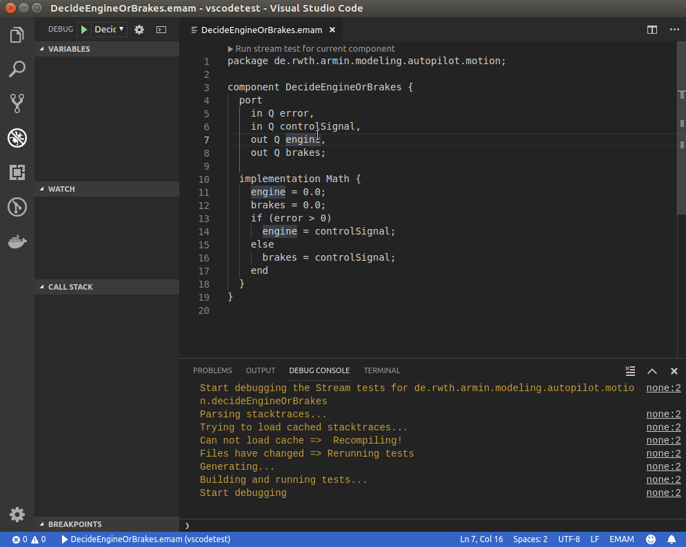
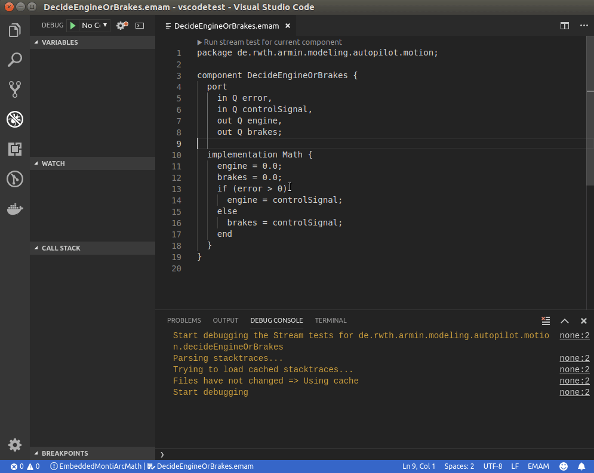

<!-- (c) https://github.com/MontiCore/monticore -->
# EmbeddedMontiArcMath debugger plugin for vscode
Based on Microsoft's [VS Code Mock Debug](https://github.com/microsoft/vscode-mock-debug).

## Usage
Open a project containing EMAM components and Steam tests as a folder and then navigate to one of your components. You can now navigate to one of your components and click on

```▶️ Run stream test for current component```




You can also add a debug configuration to your `launch.config`:




## Install
Download the latest build from [here](https://git.rwth-aachen.de/monticore/EmbeddedMontiArc/utilities/emam-debugger-vscode/-/jobs/artifacts/master/raw/emam-debug.vsix?job=LinuxBuild) and install it by:
1. Opening vscode
2. Navigating to `Extensions`(View>Extensions)
3. Navigate to `Install from VSIX...`(...>Install from VSIX...)
4. Select the downloaded File

## Update
1. Uninstall via the Extension view
2. Restart
3. Install new version as described above

## Building
Run `./build.sh` on a machine with:
- npm
- vsce

Alternatively run
```bash
npm install
vsce package -o "emam-debug.vsix"
```

## Debugging
A log file is written to the logs directory inside the extension directory(e.g. `~/.vscode/extensions/se-rwth.emam-debug-0.0.1/logs` or `./logs` when debugging)

To debug:
- Open this directory in vscode
- Navigate to View>Debug
- Select `Extension` and press `Start Debugging`
