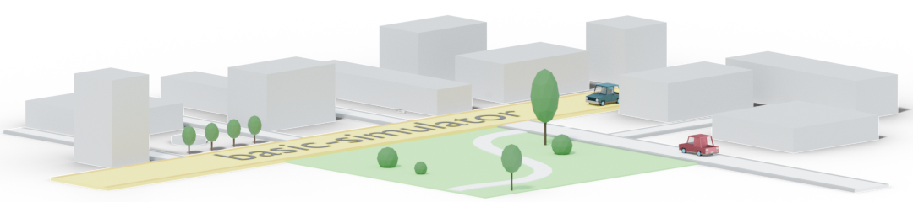
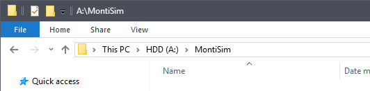
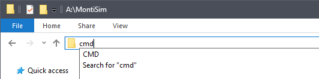
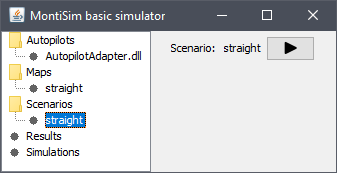
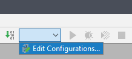
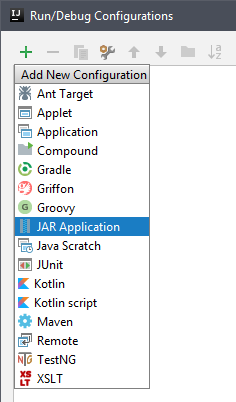
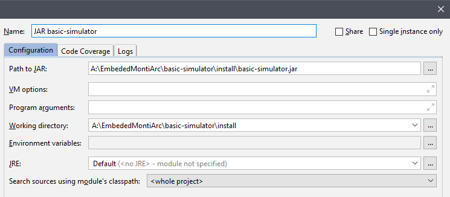

# Basic Simulator

This project is a minimal setup running the MontiSim simulator in a local self-contained jar.

## Quickstart

If you know about MontiSim and Maven, the following will suffice you:

> ```
> git clone https://git.rwth-aachen.de/monticore/EmbeddedMontiArc/simulators/basic-simulator
> cd basic-simulator
> mvn clean install -s settings.xml
> ```
> The resulting jar (`target/basic-simulator-*.jar`) can be launched normally in any folder and will create
> the required sub-folders and export the needed libraries to run simulations.

If not, the following documents aim at giving an introduction to project building, Maven, scripts and MontiSim.

# Documentation Contents

- [Installing and using the Basic Simulator](#installation_usage)
- [Maven Project tutorial](docs/maven.md)
- [Scripts tutorial](docs/scripts.md)
- [MontiSim overview](docs/montisim.md)


<a name="installation_usage"/>

# Installing and using the Basic Simulator


## Installation

This repository is a [Maven](https://maven.apache.org/) project.

In a folder (we recommend making a "MontiSim" folder containing all the cloned projects), clone the repository using the following in the console:
```batch
git clone https://git.rwth-aachen.de/monticore/EmbeddedMontiArc/simulators/basic-simulator
```
This will create a folder named `basic-simulator` and download the contents of this repository inside.

> **NOTE**: To open a console in a specific working directory rapidly in windows, type "cmd" in the navigation bar of the windows explorer and press *Enter*.
>
> For Linux choose *Right Clic -> Open in terminal* on or inside the folder.
>
> 
>
> 

To compile the Maven project, run the `install` script (*.bat* under Windows and *.sh* under Unix).

What this script does is running this command: 
```batch
mvn clean install -s settings.xml
```
This will execute the target "install" of the maven project which will compile, test and create a jar of the project. 
It will then put the jar in the `install` directory of this project as well as in the **local maven repository**. 
More on Maven in the [Maven Project tutorial](#project_tutorial) section. 

**NOTE**: Don't forget the `-s settings.xml` option. This tells Maven where the dependencies of the MontiSim project are located 
(_in the **Nexus** of the Software Engineering Chair_).

The `install` folder contains a script to start the simulator as well as a sample map, scenario and autopilot that can be 
executed.

## Using the Basic Simulator

The compiled jar file can be executed with this java command:
```batch
java -jar basic-simulator.jar
```

This will open a window listing the available **autopilots**, **maps**, **scenarios** and simulation **results**. These are 
located alongside the `basic-simulator.jar` file inside folders with the same names.

By selecting a **scenario**, you can press the "Start Simulation" button to run this scenario in the simulator.



> **NOTE**: *Currently the output of the simulation is only shown in the console.*

You can start a simulation directly without interacting with the GUI by passing a scenario name as command line argument
to the simulator:
```batch
java -jar basic-simulator.jar straight
```
> - *This would start a simulation directly with the scenario "straight"*
> - *This can be used in a script as well*

## Scenario format

The Basic Simulator uses **JSON** scenarios. This is for easier prototyping and parsing of the scenarios. The scenario [straight](../install/scenarios/straight.json) is a good
example of how to configure a scenario. For the complete configuration entries currently supported, look at the entries in the 
[BasicController.ScenarioSettings](../src/main/java/de/rwth_aachen/se/montisim/simulators/basic_simulator/controller/BasicController.java#L35) enum.
The configuration specific to vehicles can be seen in 
[VehicleBuilder.VehicleSettings](../src/main/java/de/rwth_aachen/se/montisim/simulators/basic_simulator/controller/VehicleBuilder.java#L72).

## Working on Maven projects

- To easily work on maven projects, we recommend using the [IntelliJ](https://www.jetbrains.com/idea/) editor.
- To automatically import a Maven project inside IntelliJ, open the **pom.xml** file with IntelliJ (*Open with... -> IntelliJ*).
- You can enable "**Auto import**" in the IntelliJ settings (*File -> Settings -> Build, Execution, Deployment -> Build Tools -> Maven -> Import Maven projects automatically*).
  This will try to update the project when the *pom.xml* file is changed or Maven has downloaded new dependencies.

### Compiling

Compiling might not work in IntelliJ natively because of the complex dependency setup of the simulator. Because of this compile the project using
the Maven command (*mvn clean install ...*), the easiest is to have it in a script. (For the basic-simulator, the `build_install` script will do just that.)

To avoid running all the tests *when compiling for a small change* (**always run the tests before commiting/pushing**), add the **-DskipTests** argument to the 
maven command. (`mvn clean install -s settings.xml -DskipTests`)

## Debugging the simulator

This setup of the MontiSim simulator is local and self-contained. This allows you to run the java debugger on the jar.

For this create a Run/Debug configuration that executes the jar and specify a folder in which to run it. (Ex: the *install* folder inside the basic-simulator project).
You can then start the simulator in normal or debug mode, set breakpoints and step through almost the entire code. 

(**NOTE**: To step through the [Hardware Emulator](https://git.rwth-aachen.de/monticore/EmbeddedMontiArc/simulators/hardware_emulator) you need to attach a C++
debugger to the Java simulator process.)

> Example IntelliJ configuration for running the jar in the **install** folder (Automatically exported with the `build_install` script):
>
> 
>
> 
>
> 


<a name="project_tutorial" />

# Maven Project tutorial

*Comming Soon*

> - Git recap
>   - Branches, local repos, commits, push/pull.
>   - Merge requests
> - Maven project: pom file and project structure
>   - Pom file: 
>     - describes the project name and version
>     - dependencies
>     - importing into maven
>   - Project structure:
>     - sources under src/main or src/test -> used by maven for the resulting jar / for the tests.
>     - java or resources folder
>     - docs / scripts / utility folders
>     - target folder: contains all the results of the build, including the jar.
>     - Packaging: try to use consistent package structure.
> - Maven dependency system: nexus, local repository and versioning
>   - Nexus: from the SE chair, contains all the versions from the master branch. Linked to in settings.xml.
>   - Local repository: (.m2/repository under windows) contains the dependencies from the nexus + the projects compiled using the "install" target: you can override versions/...
>   - Versioning: use next version with -SNAPSHOT when developing in a branch. Refer to this version locally. The commit that will be merged to master must NOT contain the -SNAPSHOT.
> - Maven plug-ins: build targets and plug-ins
> - Gitlab CI and other Repository plug-ins
>   - CI stages, runners

> git config credential.helper store


# Scripts tutorial

*Comming Soon*


> - Recommendation: create scripts to automate processes that take more than one short step.
> - Cheatsheet: most usefull commands under linux and windows.
> - Use cases: building, inter-project copy, testing.

> chmod +x filename.sh
> msbuild -verbosity:quiet build\hardware-emulator.sln /m /p:Configuration=Release /p:Platform=x64
> sudo apt-get install -y default-jdk
> sudo apt-get install -y openjdk-8-jdk


# MontiSim overview


*Comming Soon*

> - Project Structure
> - Simulation project
>   - Vehicle
>   - Maps
>   - Simulator
>   - Autopilots
> - RMIModelServer
> - Basic Simulator
> - Distributed System
>   - RPC
>   - Restful