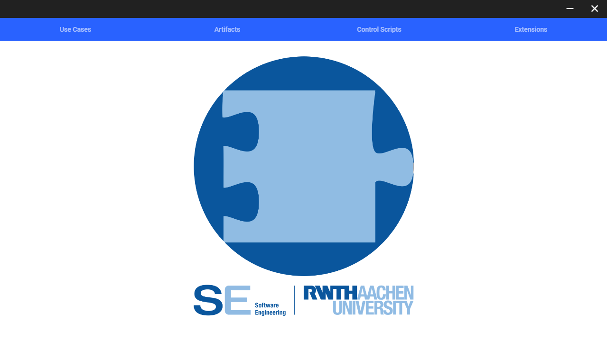
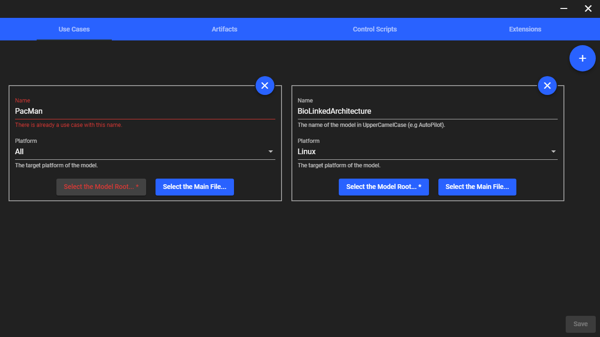
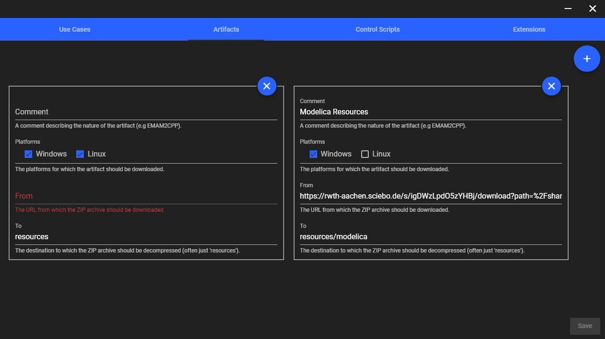
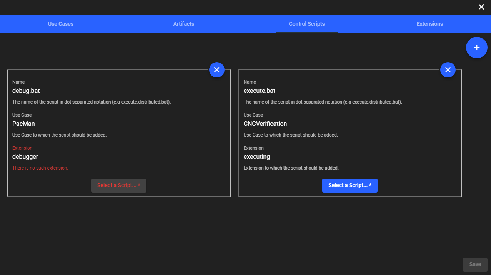
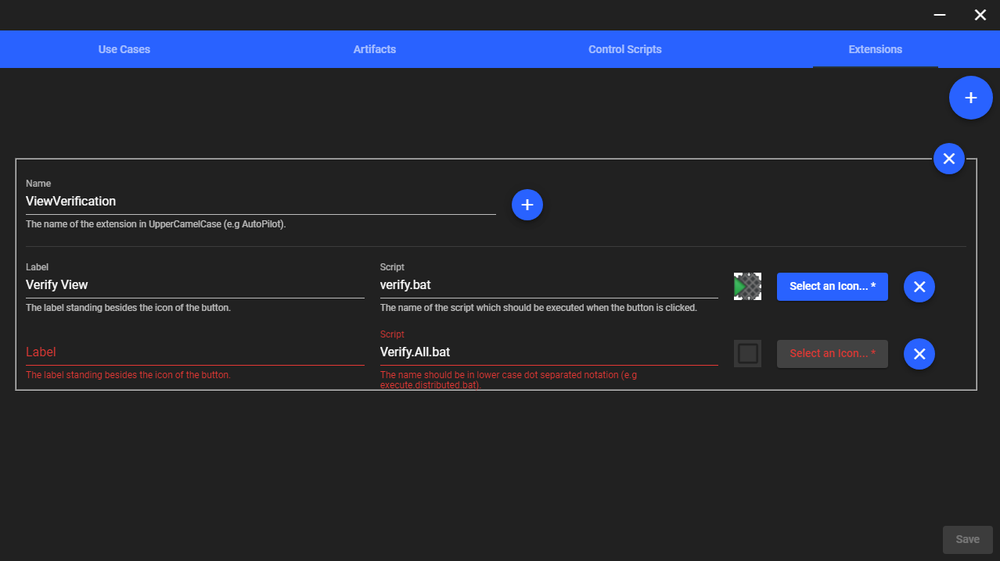

<!-- (c) https://github.com/MontiCore/monticore -->

    

    

- - -

## Table of Contents
* [**Description**](#description)
* [**Getting Started**](doc/GettingStarted.md)
* [**Gallery**](#gallery)
* [**License**](#license)

## Description
The **Manager** for the EmbeddedMontiArcStudio (**EMAS**) **Installer** or for "short" **EMASInstallerManager**
is a management tool which leverages the efficient integration of projects into EmbeddedMontiArcStudio. A more
detailed explanation can be found
[here](https://git.rwth-aachen.de/monticore/EmbeddedMontiArc/utilities/EMAStudioInstaller/blob/master/doc/GettingStarted.md#managing).

## Gallery

### Videos
|  |
| :---: |
| Demonstration |

### Images
|  |  |  |
| :---: | :---: | :---: |
| Welcome Page | Use Cases Page | Artifacts Page |
|  |  |  |
| Control Scripts Page | Extensions Page |  |

