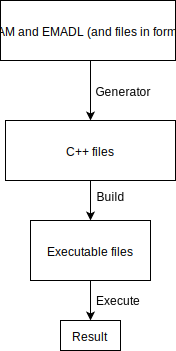
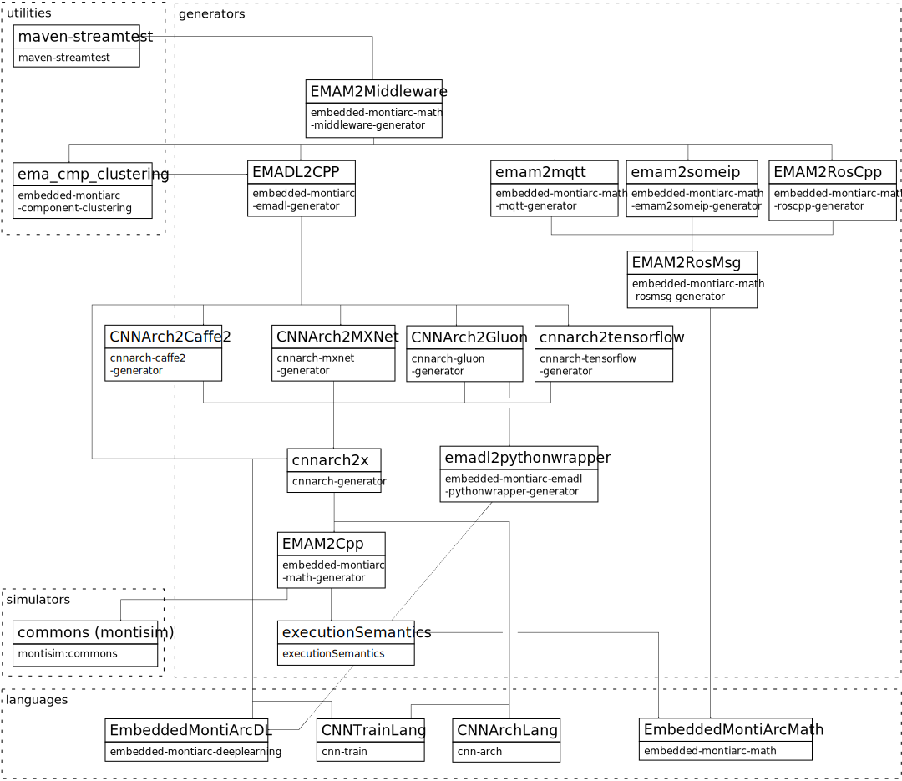

<!-- (c) https://github.com/MontiCore/monticore -->

For more information see Wiki:
[Link](https://git.rwth-aachen.de/monticore/EmbeddedMontiArc/utilities/maven-streamtest/wikis/home)

## Plugin Include 

```xml
    <plugins>
        ...
        <plugin>
            <groupId>de.monticore.lang.monticar.utilities</groupId>
            <artifactId>maven-streamtest</artifactId>
            <version>0.0.5</version>
            <configuration>
                <pathMain>./src/main/emam</pathMain>
                <pathTest>./src/test/emam</pathTest>
                <pathTmpOut>./target/tmp</pathTmpOut>
                <generator>MinGW</generator>
            </configuration>
    
            <executions>
                <execution>
                    <phase>test</phase>
                    <goals>
                        <goal>streamtest-execute</goal>
                    </goals>
                </execution>
            </executions>
        </plugin>
        ...
    </plugins>
```
## Plugin Description
The test of a component can be divided into 3 steps:
1. **Generating**: In this step, the components and unitstreams in language EMAM and EMADL are read. Their correctness are checked with the help of CoCos (Context Conditions). If a component, including its tests received no error, its corresponding C++ code will be generated in the end of this step.
2. **Building**: After generated in the first step, the C++ code is compiled in this step. Also, a neural network will be trained here if it is needed.
3. **Execution**: In this step, the streamtests of the components will be executed. The result will be verified after the execution.



## Configuration

### Streamtests

- pathMain: path of emam models
  - ```<pathMain>./src/main/emam</pathMain>```
- pathTest: path of test unitstreams and wrappers for emam components
  - ```<pathTest>./src/test/emam</pathTest>```
- pathTmpOut: temporary output path where the mojo works on
  - ```<pathTmpOut>./target/tmp</pathTmpOut>```
- pathToPython: path of python in environment
  - ```<pathToPython>/usr/bin/python</pathToPython>```
- wrapperTestExtension: (Default: _TestWrapper) filename extension. If a component cannot tested directly with a unitstream, a component with the name plus this file extension will be tested.
  - ```<wrapperTestExtension>_TestWrapper</wrapperTestExtension>```
- showBuildAndRunOutput: (Default: false) display the output of cmake, make and the execution of the streamtets.
  - ```<showBuildAndRunOutput>true</showBuildAndRunOutput>```
- forceRun: (Default: false) will force to rerun this mojo, also if it doesn't need to
  - ```<forceRun>true</forceRun>```
- generator: (windows only) 
  - MinGW: will create MinGW Makefiles ```<generator>MinGW</generator>```
  - VS2017: will create a Visual Studio 2017 C++ Project ```<generator>VS2017</generator>```
- showDateAndTime: (Default: true) will display current date and time in output log ```<showDateAndTime>false</showDateAndTime>```     
- `importArmadillo` (default: `false`): Instead of using CMake's *findModule*, imports *Armadillo* directly from the source case based on the `ARMADILLO_HOME` environment variable.
  - `<importArmadillo>true</importArmadillo>`
- `generateLibraryInterface` (default: `false`): Generates the *library_interface* to be loaded by MontiSim simulations.
  - `<generateLibraryInterface>true</generateLibraryInterface>`
- `generateServerAdapter` (default: `false`): Generates the *server_adapter* to remotely connect to MontiSim simulations.
  - `<generateServerAdapter>true</generateServerAdapter>`

### Middleware

- middlewareGenerator: identifiers for the generators that should be used. 
  - Currently supported: cpp, roscpp, odv, emadlcpp
  - ```
    <middlewareGenerator>
        <param>cpp</param>
        <param>roscpp</param>
        <param>odv</param> 
        <param>emadlcpp</param>        
    </middlewareGenerator>
    ```
- middlewareRootModels: fully qualified name of the root model(s)
  - ```
    <middlewareRootModels>
        <param>test1.and</param>
        <param>tests.a.addComp</param>     
    </middlewareRootModels>
    ```
- pathMiddlewareOut: path of the generated middleware output 
  - ```<pathMiddlewareOut>./target/middleware</pathMiddlewareOut>```
- runStreamTestBefore: (Default: true) indicates if the streamtests should be executed before the middleware generation
  - ```<runStreamTestBefore>true</runStreamTestBefore>```  
- emadlBackend: (Default: GLUON) deep learning backend to be used in middleware plugin
  -```<emadlBackend>GLUON</emadlBackend>```

## Goals / Mojos

### Streamtest

1. **streamtest-generator** : generates c++ for all components which have a streamtest
1. **streamtest-build** : builds the executable streamtest out of the generated c++ code
1. **streamtest-execute** : runs streamtests executables and checks if their output is valid

### Middleware

1. **streamtest-middleare-generate** : generates cpp / roscpp / odv (and so on) code for the given emam models 
1. **streamtest-middleare-build** : runs cmake and make for generated c++ code


# Dependency Graph of this project

