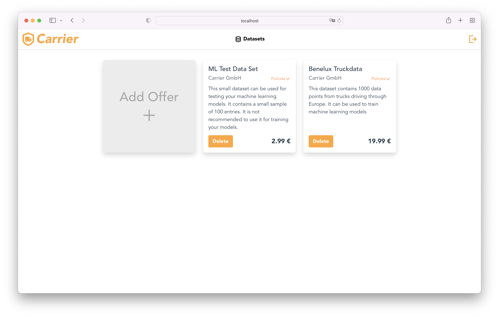
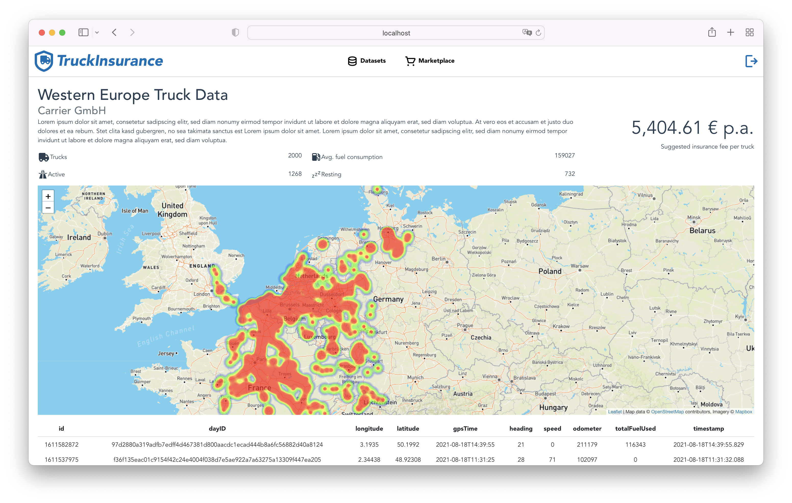
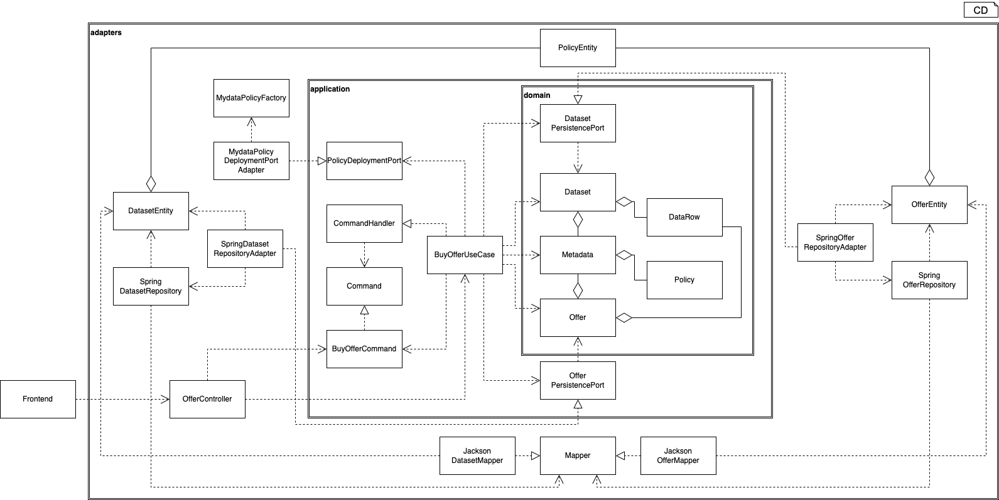

# data-consumer
The data consumer system is an exemplary insurance application. Truck records can be purchased from carriers via a marketplace.

Records are provided with policies that are automatically enforced by the application.
The records can be used for analytics purposes.  As an example, in the details view the data is shown on a geographic heat map. An insurance fee is also calculated.


## Architecture
The application follows a use case driven approach. The entry point is always an end point in the controller. An endpoint invokes exactly one use case. The use case then controls the application logic and the data flow in the domain. The interaction of the individual layers and classes can be seen in the following class diagram, which shows the BuyOfferUseCase.


## How to start the application?
The following guide explains how run a dockerized version of this application for demo purposes and also
how to run a local version with Intellij for development purposes. To use all functions, the data-consumer application must run in the same mode. You can find a guide
how to start it [here](https://git.rwth-aachen.de/monticore/EmbeddedMontiArc/applications/catena-x/data-provider).

In both cases, the application will be reachable at [http://localhost:8081/marketplace](http://localhost:8081/marketplace).

For both approaches, the following two steps have to be executed first. 

Clone the project:

```
git clone https://git.rwth-aachen.de/monticore/EmbeddedMontiArc/applications/catena-x/data-consumer.git

```

Move into the root directory:
```
cd data-consumer
```

### Starting the application in Docker
The whole application can be started completely in Docker. A separate container for the PostgreSQL database, 
the Spring Boot backend and the Vue.js frontend will be started.

To start the dockerized version of the application, first set a symlink to the production environment file:
```
ln -s .env.production .env
```
After this, start all services with docker-compose:
```
docker-compose up
```
### Starting the application in local mode for development
When developing, you usually want to start the application with your IDE. Here I assume that you
use Intellij. Make sure the Intellij plugin EnvFile is installed. You can find it [over here](https://plugins.jetbrains.com/plugin/7861-envfile).

The database still will be started in Docker, so you don't need to install it on your
host machine.

To start the development version of the application, first set a symlink to the development environment file:
```
ln -s .env.development .env
```
Then, start the database with docker-compose:
```
docker-compose up database
```
After this, you can start the backend with the **`ConsumerSpringBootApplication.run.xml`** run configuration that is contained 
in this repository. Intellij will automatically import it as run configuration. Therefore, you just have to click
the green RUN button at the top.

Now, when the backend is running, you can start the frontend. Move into the frontend directory:
```
cd frontend
```
Finally, start the Vue.js app with:
```
npm run serve
```
