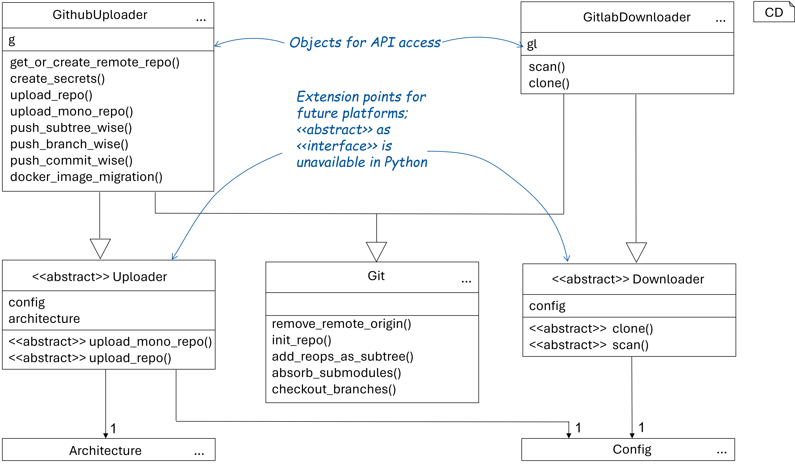
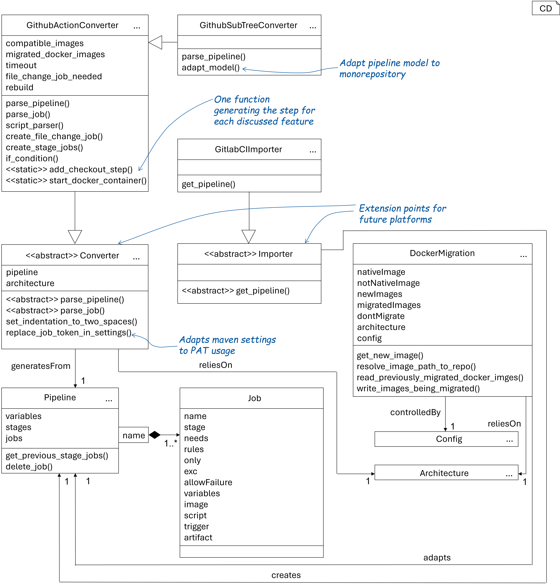

# Installation

Please install the migration tool using:

```bash
pipx install PATH_TO_WHEEL
```

# Usage:

This only explains the default workflow. For more information about eventual flags use the `--help` flag of the command
and each subcommands.
Currently, the tool supports the repository-wise or monorepository migration from GitLab to GitHub.

1. Create a configuration file by running

```bash
migrationTool create-config
```

After this a file names `config.yaml` is created and needs to be filled out.

2. Scan and clone the specified repositories by running

```bash
migrationTool scan-clone
```

This will create a folder named `repos` in the current directory and clone all repositories specified in the
`config.yaml` file. Each repo will be cloned completely, including all branches. Afterward, the connection to the
remote
is removed. Then the repos are scanned and an `architecture.yaml` file will be created. Here all the information about
the repo will be summarized. To choose which branches or docker images are to be migrated, the user can simply
remove all the unwanted ones.

3. Migrate the repositories by running

```bash
migrationTool migrate-repos
```

This prepares the repos for building the monorepo. It removes large files, completely from the git history using
`git filter-repo`. If you want to save such large files, this is also possible by splitting them into smaller chunks.
THis feature is only available for UNIX systems. Additionally, it removes all traces of `git lfs`.

4. Create the monorepo by running

```bash
migrationTool create-monorepo
```

This creates the monorepo and adds all the repositories to it. The monorepo will be created in the current directory. If
a repository with the monorepo name already exists, it is reused. All the subtrees are uploaded to a newly created
branch named Migration_Date_Time. This ensures that this step does not interfere with the current work on the monorepo.
The branch can be merged into the main branch later. The monorepo is created using `git subtree` and all the
repositories are added as subtrees. This ensures the
integrity of the repo current state. Especially later in the upload step.

5. Convert the GitLab pipelines to GitHub actions by running

```bash
migrationTool convert-gh-actions
```

This converts the pipelines in the currently checked-out branch to GitHub actions. Before migrating the pipelines, all
maven files in the repo are changed to be compatible with Private Access Tokens. During the migration for each pipeline,
the excluded branches are checked so that only intended Jobs are kept. As this feature is inherently incompatible with
the monorepo design. To rebuild the stage-like architecture a job named `STAGENAME_phase` is created. Additionally, a
job named `FileChanges` is created. This job is used to check file changes and trigger the corresponding jobs. As this
is
not natively supported in GitHub actions. Per default, the necessary changes for monorepos are implemented. Otherwise, a
flag must be added.

6. Upload the monorepo to GitHub by running

```bash
migrationTool upload
```

This uploads the monorepo to GitHub. This first checks whether a repo with the same name already exists and creates one
if necessary. After this it creates the specified secrets in `architecture.yaml`. For each secret only one value is
used. Please make sure that they are equal in all entries across the scanned repos. Next, the monorepo is pushed. For
this the commit messages in each branch are scanned for the word `subtree` and each commit containing it is pushed
separately in sequentially chronological order. This ensures that the git push limit is not reached and enables fallback
in case of failure. This is done automatically for each new branch; for each branch already existing in the monorepo,
the user can choose whether to override it. At this point one has to be cautious as this would be done with
`force pushes`. A master branch is only created if it is not present in the current repo. If it is pushed, it is also
set as the default branch.

If a repository-wise migration is desired, the user can simply run the command with an additional fla. In these cases, the
history will be pushed branchwise.

# Example

A sample configuration file of the first batch from the migration of this project is available under `example/`. To test
it, add your usernames and token. Afterward, the migration tool can be invoked there. 

# Pipeline Migration compatibility
The list below aims to help users asses whether their pipeline is compatible with the migration tool. 
Please note that you should still evaluate your pipeline after the migration, even if it should be supported.
The tool only uses the ubuntu latest runners and automatically adapts docker images in both the down- and upload 
if they are to be migrated. Finally, the tool can also implement the monorepository related changes automatically, if required.


| Feature       | Description                                         |
|---------------|-----------------------------------------------------|
| Stages        | Supported by creating extra jobs                    |
| Defaults      | Use default values, if nothing else specified       |
| Variables     | Maintained at pipeline level                        |
| except        | Branches handled in job; changes in fileChange job |
| only          | Branches handled in job; changes in fileChange job |
| rules         | Handled in fileChange job                         |
| needs         | Supported                                           |
| artifacts     | Supported, but expiration-time may be changed,      |
| reports       | Supported for jUnit                                 |
| trigger       | Supported                                           |
| pages         | Supported                                           |
| script        | Supported                                           |
| docker images | Supported, both with and without Node.js 20         |   


# Structure

The tool is structured into three submodules:

1. `migration_types`: Contains several shared datatypes
   
2. `git_migration`: Implements the migration of the git repositories and monorepo creation
   
3. `pipeline_migration`: Implements the migration of the CI/CD pipelines
   

Please note that the class diagrams are not complete and only show the classes. Several parts are only implemented in
functions and therefore not shown here.

A selection of helpful script is available in the `scripts/` folder. These can be, for example, used to delete
unnecessary GHA runs from the overview, or stop all pending ones. 


