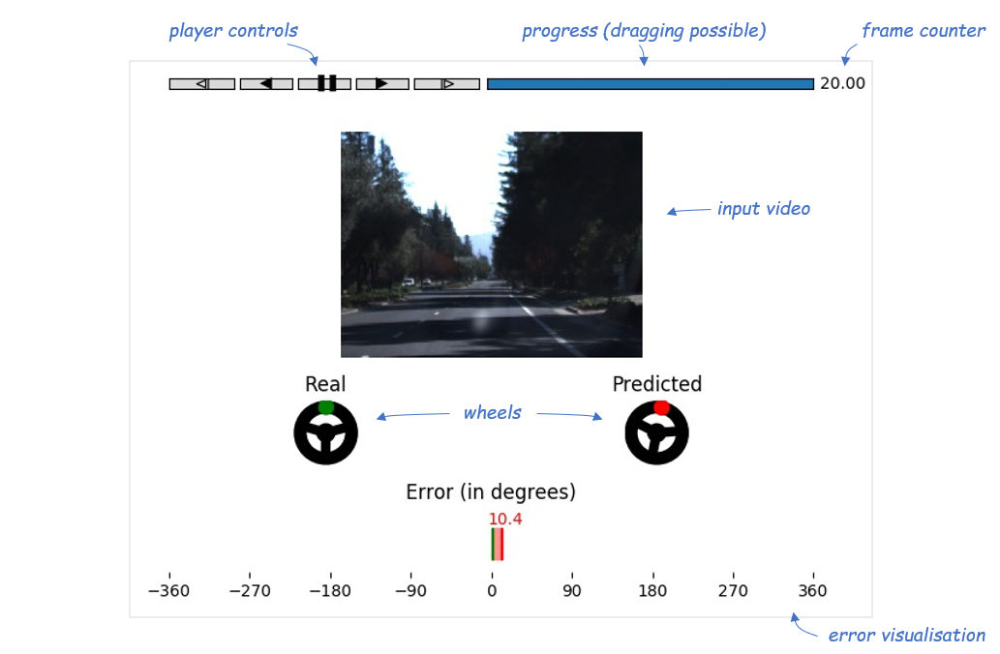
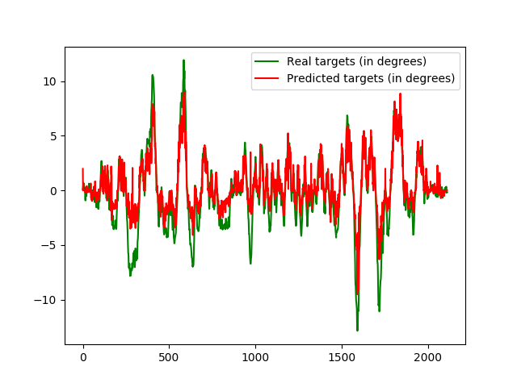

<!-- (c) https://github.com/MontiCore/monticore -->
# End2EndDriving

This repository consists of a neural network for end to end driving and some useful tools. It implements [this paper](https://images.nvidia.com/content/tegra/automotive/images/2016/solutions/pdf/end-to-end-dl-using-px.pdf) by Nvidia on End to End driving. In summary, the paper describes a method to predict steering angels for a given input image of a camera, which is mounted to the front of a car.

## Requirements

- OpenCV, h5py, numpy, PIL, matplotlib and scipy for Python 3: `pip3 install opencv-python h5py numpy Pillow matplotlib scipy`
- Tensorflow for Python: `pip install tensorflow==1.13.1`
- OpenCV for C e.g. `sudo apt install libopencv-dev libarmadillo-dev`
- Tensorflow for C: [This repo might help you](https://github.com/FloopCZ/tensorflow_cc)

## Usage

- Go into tensorflow directory

### Training

- Generate `train.h5` and `test.h5` files and move them to resources/training_data.[(See section Generation of Training Data)](https://git.rwth-aachen.de/monticore/EmbeddedMontiArc/applications/end2enddriving/tree/master/tensorflow/resources). The pictures should have the same dimensionality as described in the model and the label *data*. The output is a steering angle with the label *target_label*.
- Train by executing `./build.sh`

### Prediction
 :warning: Prediction is only possible if you have trained first. :warning: 

|  | Predict | Visualise | Command |
|:---|:---|:---|:---|
| 1 | &#9745; | | `python3 v-tool/cli.py -i test.h5 -p` |
| 2 | &#9745; | &#9745; | `python3 v-tool/cli.py -i test.h5 -p -v` |
| 3 |  | &#9745; | `python3 v-tool/cli.py -i test.h5 -v` (execute 1 or 2 first)|

Additionally you can control the delay between the pictures with `-d` and add a plot showing both real target and prediction in a time series graph by adding the `-t` flag. 

### Visualisation

Predictions are visualized through a Python GUI using Matplotlib. It shows the input frames (frontal camera), the according real steering angels and predicted steering angels as rotating wheels, and the predction error (in angels).

- Example of using python3 v-tool/cli.py -i train.h5 -v -t 
- Note: This plot reflects the prediction on a training set generated from  [Udacities CH2 driving challange](https://github.com/udacity/self-driving-car/tree/master/datasets/CH2).  
    - 400 Epoches
    - resolution sclaed down fron 480/640 to 60/80 
    - learning rate 0.001 
    - 20% straight driving 80% curves
- Furthermore, if the ground truth is availiable for the testing set the command can be adjusted acordingly.
- (Udacity's CH2 testing data which was our testing data does not provide the ground truth)

## Generation of Training Data

Read the README.md located in the `tensorflow/resourcess` mddirectory.

### Hyperparametes

Hyperparameters that we experimented with were:

- Batchsize (1, 5, 10, 20, 40, 50, 100)
- Epochs (10, 100, 150, 250, 500)
- Optimizer (Adam), Learning Rate (0.01, 0.005, 0.001) & Weight Decay
- Image resolution (640x480, 160x120, 80x60, 64x48)
- Time gap between images (30FPS, 10FPS)
- Model architecture (modifications to the original architecture from the [paper](https://images.nvidia.com/content/tegra/automotive/images/2016/solutions/pdf/end-to-end-dl-using-px.pdf))
    - Different Activations (ReLU, Sigmoid)
    - Different usage of Dropout to learn learn curves
    - With(out) Batch-normalization
    - With(out) large fully connected layer after convolutional layers
    - Different number of layers with different kernel sizes 
    - With(out) input/output normalization (mean 0, std 1)
- Training data
    - Training data is from  [Udacity](https://github.com/udacity/self-driving-car)
    - 1st Dataset: Combined Driving Dataset / Legacy Data 09/29/2016 &  10/03/2016
    - 2nd Dataset: Driving Dataset CH2
    - Number of inputs
        - 3 cams (left, center, right)
        - 1 cam (only center)
    - Number of training images (100, 1000, 10000, 33000)
    - Used subsets of the training data
        - Using only images of slightly before, during and slightly after driving curves
        - Using only images of driving straight
        - Using mixed images of both curves and driving straight with different ratios (50% , 30%, 20%, 10%) 
            - condition at least 50% driving curves 
    - Changes to targets (original value is radians of steering angle, > 0 for left turns, < 0 for right turns, range [-10,10])
        - 1/angle following paper
        - angle in degree (continues value)
        - angle in degree (natural discrete number)
        - angle in radian > 0 (+ 10)
        - turning radius of the specific car used 
        
### Observations

The task of end2end learning in itself turned out to be very hard. We concluded from our tests that, unless there is access to a very large dataset and computational resources, the results are very poor. Additionally, as the only input we have is up to 3 images of one specific "moment" i.e. we don't actually know where the driver *wants* to drive, it doesn't really make sense to interpret the prediction as "Where should we drive?" but rather "Where are we driving?". Some key obersvations were.
- As the dataset consists mostly of sections of "straight driving", learning to take curves is difficult. Unless the training data is tailored to include larger sections with curves, the model only learns to drive straight. It even goes as far as predicting the exact same value for almost every input image.
- Larger image resolutions results in worse predictions with equal amount of computational power.
- Batch-normalization almost always had a negative effect.
- When using ReLU activation, longer training frequently resulted in dying ReLUs.
- Input/output normalization didn't have a large effect.

