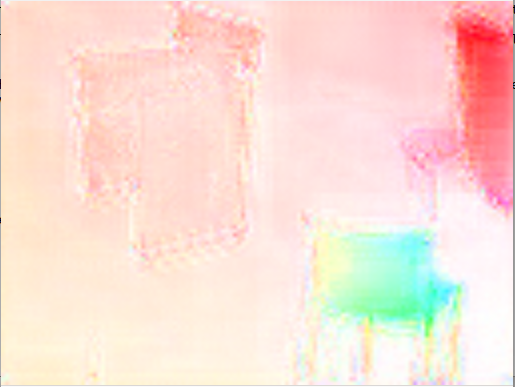

<!-- (c) https://github.com/MontiCore/monticore -->
# FlowNet

## Prerequisites (also see the install instructions for the tensorflow backend / for all backends in the CNNArch2Tensorflow and EMADL2CPP backends)

1. Ubuntu Linux 16.04 LTS or 18.04 LTS (experimental)
2. Deep Learning Framework **Tensorflow**
3. Armadillo (at least armadillo version 6.600 must be used) [Official instructions at Armadillo Website](http://arma.sourceforge.net/download.html).
4. OpenCV


## How to Run

Generate and build the code for the EMADL model by executing:

```
bash build.sh
```

Finally, run the network as follows:


```


./build/src/cpp/FlowNetS resources/images/00069_img1.ppm resources/images/00069_img2.ppm 
```

You can try different images from the provided `/resources/images` directory.

Our 10 Epoch trained model on the whole dataset was uploaded to the sciebo repository of EmbeddedMontiArc due to its size (2GB).

## Summary

We implemented the FlowNetS (flow net simple) described in the paper found at [Paper](https://lmb.informatik.uni-freiburg.de/Publications/2015/DFIB15).
For implementation details (like parameter values or actual layer outline) we also took also refrence to the following repository, wich in turn is based 
on the original implementation by the authors of the afore mentioned paper: [Tensorlflow implementation](https://github.com/sampepose/flownet2-tf)

These network learn to predict the so called "optical flow", between to input images, which is the optical displacement between the content of these images.


## The Training Data

The network was trained by the fliing chairs dataset mentioned in the flow net paper. The dataset can be downloaded alongside a split in training an testing set from their webpage:
[Dataset](https://lmb.informatik.uni-freiburg.de/resources/datasets/). To then use this with this application the data has to be transformed to h5 files. For this we provide the script tensorflow/resources/flyingchairstohd5.py.
It can be used as follows: 
```
python3 flyingchairstohd5.py *PATH to the folder with the images*
```
Here it is important to use pyhton3. This may take some time and the resulting files will be around 110GB large.


## Our Results

We trained our network for 10 epochs wich took roughly 2 hours or 13 minutes per epoch on a GeForce GTX 1080 GPU. We got an epe error of roughly 5.5 on the validation
set, which is close to the results achieved in the paper. We observed that it seems that dark or cluttered (in terms of much structure) backround results in worse results.

One examples is shown, first the two links to to images with slightly dispalced chairs and then the prediction displayed here:  <br/>


Another examples:  <br/>


## Possible future work

* The implementation of the variants FlowNetC and FlowNet2 which are based are based on FLowNetS may be explored.
	 
* Also the LeakyRelu variant may be added the Arch Lang.
	
* Addtional to learned upsampling by UpConvolutional layers it may be intresting to also have other upsampling layers, like linear upsampling.
	
* Further it might be convenient if it would be possible to be able to transform one provided target (flowfield), like rescaling, in the 
generated code, instead of saving all required scales in the h5 files.
	 
* Extende training over more epoch may also be explored
	
* Testing the image on other data, that is not from the Flying Chairs dataset may also be intresting. Accroding to the paper this shall give acceptable results.
	
	
## Refrence

1. "A. Dosovitskiy and P. Fischer and E. Ilg and P. Häusser and C. Hazırbas and V. Golkov and P. v.d. Smagt and D. Cremers and T. Brox", "FlowNet: Learning Optical Flow with Convolutional Networks", 
"IEEE International Conference on Computer Vision (ICCV)", 2015, http://lmb.informatik.uni-freiburg.de/Publications/2015/DFIB15
 	
 2. "E. Ilg and N. Mayer and T. Saikia and M. Keuper and A. Dosovitskiy and T. Brox", "FlowNet 2.0: Evolution of Optical Flow Estimation with Deep Networks", 
"IEEE Conference on Computer Vision and Pattern Recognition (CVPR)", "2017", http://lmb.informatik.uni-freiburg.de/Publications/2017/IMSKDB17
	
3. sampepose, https://github.com/sampepose/flownet2-tf, last accesed 26.09.2019
