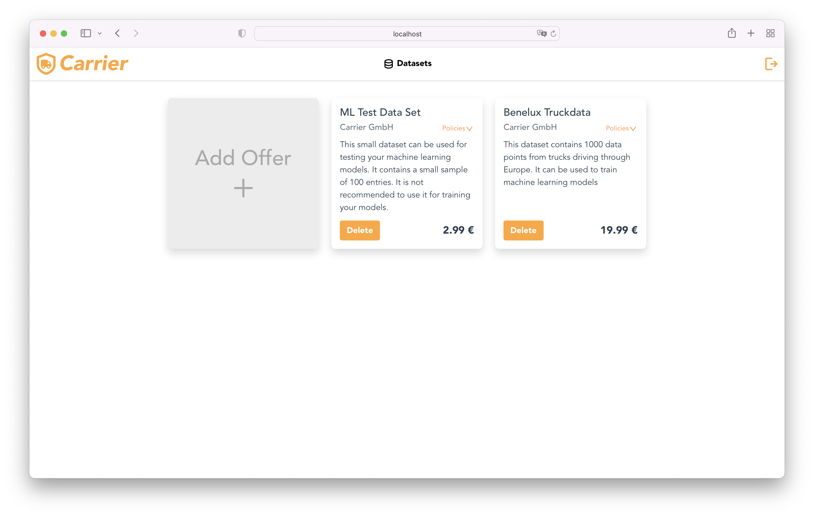
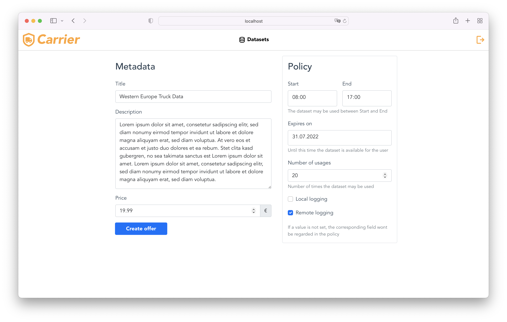

# data-provider
The data provider system is an exemplary carrier application. A carrier can sell records to an insurance company through a marketplace.

The data sets can be assigned usage rules that the insurance company must adhere to. The usage rules can, for example, restrict the times of use or the number of uses. The carrier may also require that it be notified when its data is used.

## How to start the application?

The following guide explains how run a dockerized version of this application for demo purposes and also 
how to run a local version with Intellij for development purposes. To use all functions, the data-consumer application must run in the same mode. You can find a guide
how to start it [here](https://git.rwth-aachen.de/monticore/EmbeddedMontiArc/applications/catena-x/data-consumer).

In both cases, the application will be reachable at [http://localhost:8083/#/offers](http://localhost:8083/#/offers).

For both approaches, the following two steps have to be executed first.

Clone the project:

```
git clone https://git.rwth-aachen.de/monticore/EmbeddedMontiArc/applications/catena-x/data-provider.git

```

Move into the root directory:
```
cd data-provider


```

### Starting the application in Docker
The whole application can be started completely in Docker. A separate container for the Spring Boot backend 
and the Vue.js frontend will be started.

To start the dockerized version of the application, first set a symlink to the production environment file:
```
ln -s .env.production .env
```
After this, start both services with docker-compose:
```
docker-compose up
```
### Starting the application in local mode for development
When developing, you usually want to start the application with your IDE. Here I assume that you
use Intellij. Make sure the Intellij plugin EnvFile is installed. You can find it [over here](https://plugins.jetbrains.com/plugin/7861-envfile).

To start the development version of the application, first set a symlink to the development environment file:
```
ln -s .env.development .env
```
Then, start the database with docker-compose:
```
docker-compose up database
```
After this, you can start the backend with the **`ProviderSpringBootApplication.run.xml`** run configuration that is contained
in this repository. Intellij will automatically import it as run configuration. Therefore, you just have to click
the green RUN button at the top.

Now, when the backend is running, you can start the frontend. Move into the frontend directory:
```
cd frontend
```
Finally, start the Vue.js app with:
```
npm run serve
```
