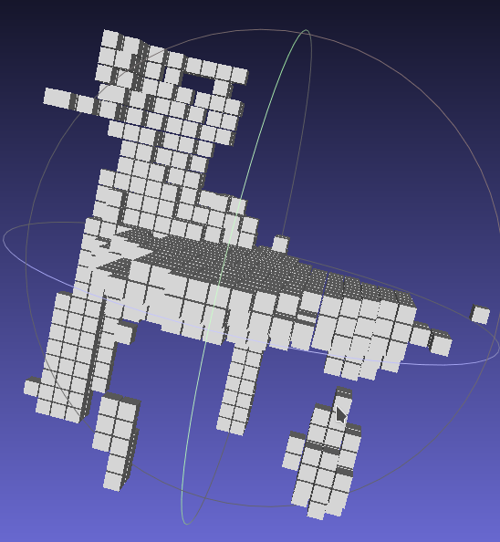
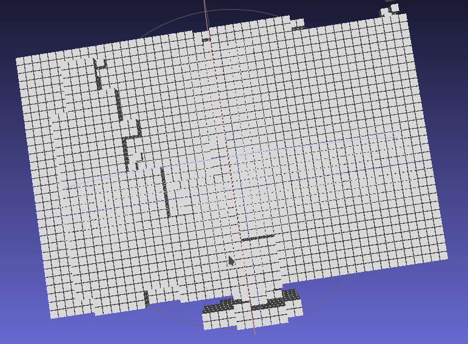
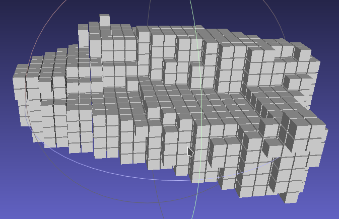
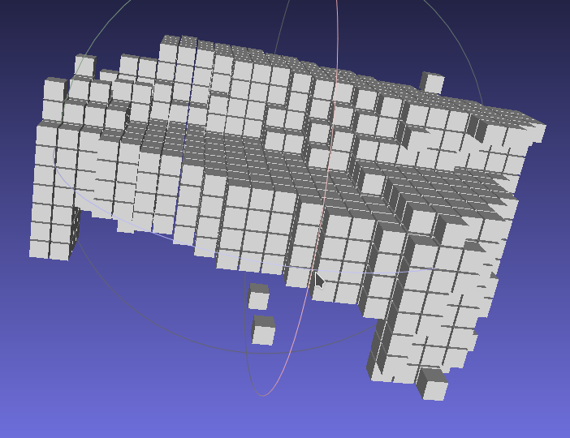

# 3d-gan
This is the repository for the 3D-GAN Project modeled in EMADL.
3D-GAN generates diverse objects from different categories. The files created have the Wavefront OBJ file format. You can use any exisiting visualization program to open these files. 
This repo contains pretrained parameters and the model files that can be used for EMADL.
**The 3D Convolution layers used on this model only run on GPUs.**

You can either use the provided visualize.py script in Pre-Trained/resources/Scripts to generate an object or the compiled program called with any number.

To change the object category for the pre-trained model, copy the model_0_newest-symbol.json and model_0_newest-0000.params file from one of the threedgan.Generator folders in resources into the Pre-Trained directory.
So to generate a bathtub, copy the files from
`<path>resources/model/res_64/bathtub/threedgan.Generator/`.

