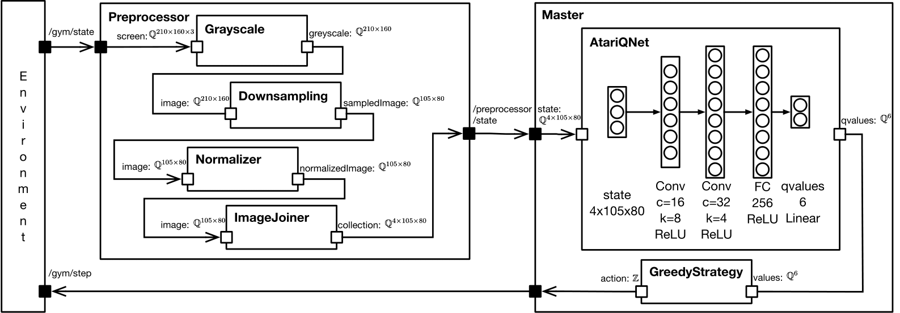

<!-- (c) https://github.com/MontiCore/monticore -->
# Reinforcement Learning Agent for Pong-v0

EMADL model of a DQN Agent for the [OpenAi Gym environment](https://gym.openai.com/envs/Pong-v0/) `Pong-v0`. Based on the model, code is generated that trains on the mentioned environment.

This model rebuilds the preprocessing pipeline and the Atari agent of [Mnih et al.](https://arxiv.org/abs/1312.5602).



The replay buffer is shrinked to a size of 50000 in order to run the training. The training still requires a high amount of training time and memory.

## Prerequisites

In order to run this application you need the following tools:

### General

Generation, training, and execution were tested on Ubuntu 16.04 LTS. The generation, training, and execution of the model requires the following tools and packages:
  
- Java 8, Build Tools (make, cmake, gcc), Git, Python 2.7, pip, numpy, SWIG:

    ```bash
    sudo apt install openjdk-8-jre gcc make cmake git python2.7 python-dev python-numpy swig libboost-all-dev curl
    ```
- Python pip:
    ```bash
    curl https://bootstrap.pypa.io/get-pip.py -o get-pip.py
    python get-pip.py --user
    ```

- Python packages for numpy, h5py, pyprind, matplotlib:

    ```bash
    pip install --user h5py numpy pyprind matplotlib

    
    ```

- MXNet C++ Language Bindings (Follow official [installation guide](https://mxnet.incubator.apache.org/versions/master/install/ubuntu_setup.html))
- MXNet for Python (Follow official [installation guide](https://mxnet.incubator.apache.org/versions/master/install/index.html?platform=Linux&language=Python&processor=CPU))
- Armadillo >= 9.400.3 (Follow official [installation guide](http://arma.sourceforge.net/download.html))
- ROS Kinetic (Follow official [installation guide](http://wiki.ros.org/kinetic/Installation/Ubuntu))
- OpenAI-Gym: Follow official [installation guide](https://github.com/openai/gym#installation)

Note that this application requires the [Atari](https://github.com/openai/gym/blob/master/docs/environments.md) environment of OpenAI-Gym.


## Generate and Train

**Attention:** Check the training context in the training configuration `src/model/atari/agent/network/AtariQNet.cnnt`. Only use the context "gpu" if you have installed the CUDA packages and the corresponding version of MXNet. Otherwise choose the context "cpu".

1) The `bin` folder already includes a prebuild of the middleware generator. We can start the generation by running the install script.
    ```bash
    ./install.sh
    ```
    The install script will generate the Python Reinforcement Learning trainer and the C++ files for the executable model into the `target` folder. The preprocessor is also generated. Furthermore, the install script will automatically build the executable models. The binaries can be found in `target/bin/agent` and `target/bin/preprocessor`.

2) Run the environment with the following command. The command will start the ROS master node, the ros-gym environment, and the preprocessor.
    ```bash
    ./run_environment
    ```

3) Start the training by running
    ```bash
    ./run_training
    ```

Note that the agent cannot be interrupted, as the replay buffer is too large for Python pickle.

## Troubleshooting
- **MXNET Library not found:** During the building of the executable model, we require the MXNet libraries. Ensure that  `/usr/include` and `/usr/lib` include the MXNet library files. You can add the library files by doing the following: 
    ```bash
    cd /usr/include
    sudo ln -s path/to/incubator-mxnet/include/mxnet .
    cd /usr/lib
    sudo cp ~/incubator-mxnet/build/libmxnet.so .
    ```
- **fatal error: numpy/arrayobject.h: No such file or directory** The numpy include files are not included in the global `/usr/include` directory. Usually, the missing files can be found in the directory `/usr/local/lib/python2.7/dist-packages/numpy/core/include/numpy`. If not, you can run a python script which outputs the location:
    ```python
    import numpy
    numpy.get_include()
    ```
    After that you can copy the files to the global include directory:
    ```bash
    cp -r /usr/local/lib/python2.7/dist-packages/numpy/core/include/numpy /usr/local/include
    ```
