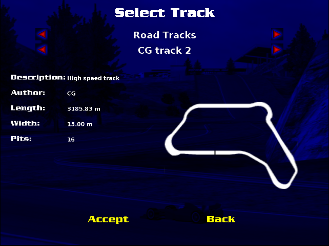
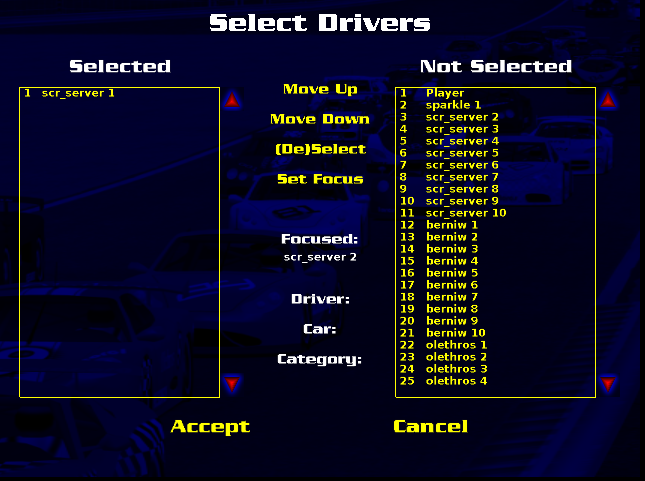
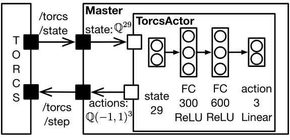
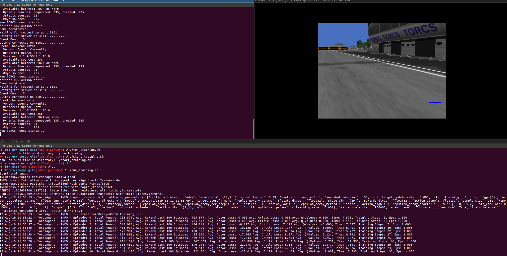

<!-- (c) https://github.com/MontiCore/monticore -->
# EMADL Reinforcement Learning Agent for TORCS

EMADL model of an DDPG and TD3 Agent for the [TORCS](https://sourceforge.net/projects/torcs/) environment. Based on the model, code is generated that trains a car to drive on a racing track.
We provide a different prebuild versions with already trained parameters in the ```prebuild``` folder.

Content:
- [EMADL Reinforcement Learning Agent for TORCS](#emadl-reinforcement-learning-agent-for-torcs)
  - [Prerequisites](#prerequisites)
    - [General](#general)
    - [Installation Guide for TORCS Environment](#installation-guide-for-torcs-environment)
  - [The EMADL model](#the-emadl-model)
  - [Generate and Train](#generate-and-train)
  - [Run Prebuild](#run-prebuild)
  - [Troubleshooting](#troubleshooting)

## Prerequisites

In order to run this application you need the following tools:

### General
Generation, training, and execution were tested on Ubuntu 16.04 LTS. The generation, training, and execution of the model requires the following tools and packages:
  
- Java 8, Build Tools (make, cmake, gcc), Git, Python 2.7, pip, numpy, SWIG:

    ```bash
    sudo apt install openjdk-8-jre gcc make cmake git python2.7 python-dev python-numpy swig libboost-all-dev curl
    ```
- Python pip:
    ```bash
    
    curl https://bootstrap.pypa.io/get-pip.py -o get-pip.py
    python get-pip.py --user
    ```

- Python packages for numpy, h5py, pyprind, matplotlib:

    ```bash
    pip install --user h5py numpy pyprind matplotlib
    ```

- MXNet C++ Language Bindings (Follow official [installation guide](https://mxnet.incubator.apache.org/versions/master/install/ubuntu_setup.html))
- MXNet for Python (Follow official [installation guide](https://mxnet.incubator.apache.org/versions/master/install/index.html?platform=Linux&language=Python&processor=CPU))
- Armadillo >= 9.400.3 (Follow official [installation guide](http://arma.sourceforge.net/download.html))
- ROS Kinetic (Follow official [installation guide](http://wiki.ros.org/kinetic/Installation/Ubuntu))
- Environment ros-gym-torcs (see following guide)

### Installation Guide for TORCS Environment
The TORCS environment application can be found in the folder ```bin/ros-gym-torcs```. The environment provides a ROS-wrapper for controlling the car in TORCS. The environment builds upon the Gym-TORCS implementation of [Naoto Yoshida](https://github.com/ugo-nama-kun/gym_torcs). In order to run this environment, you need the following prerequisites:

- xautomation:
  
    ```bash
    sudo apt-get install xautomation
    ```

- OpenAI-Gym: Follow official [installation guide](https://github.com/openai/gym#installation)

**Installation:**

1) Install the required libraries for TORCS:

    ```bash
    sudo apt-get install libglib2.0-dev  libgl1-mesa-dev libglu1-mesa-dev  freeglut3-dev  libplib-dev libopenal-dev libalut-dev libxi-dev libxmu-dev libxrender-dev  libxrandr-dev libpng12-dev
    ```

2) Get the Repository Gym-TORCS which includes VisualTORCS and install it:

    ```bash
    git clone https://github.com/ugo-nama-kun/gym_torcs.git
    cd gym_torcs/vtorcs-RL-color/
    ./configure
    make
    sudo make install
    sudo make datainstall
    ```

3) After the installation, we can configure the race in TORCS. Start TORCS with the command. If settings are not saved when starting TORCS again then try to start torcs with `sudo` and configure the race again.

    ```bash
    torcs
    ```

4) Choose a race track by navigating to Race -> Practice -> Configure Race. For our training we selected the track "CG Track 2". Confirm with Enter. Select the driver "scr_server1" and press Enter. In the next screen set the lap number to 100 and press Enter again. After that we are back at the Race menu. Here you can start the race with the option New Race. The screen stops with several text information.

    
   
     

5) Open a terminal and navigate to `bin/ros-gym-torcs/gym_torcs` and run snakeoil_gym.py with

    ```bash
    cd bin/ros-gym-torcs/gym_torcs
    python snakeoil3_gym.py
    ```

6) After this command the race starts. You can select the "drivers view" with the F2 key. After that, you can quit the race and close TORCS.


## The EMADL model


For the Reinforcement Learning agent, we provide two versions of the model. The first one is a TD3 agent, and the second one is a DDPG agent. In the following, we describe the TD3 agent, but the DDPG agent is similar. For our agent, we define an actor in `src/models/agent/network/TorcsActor.emadl` and the critic in `src/models/agent/network/TorcsActor.emadl`.

The actor gets as input the current state of the environment, which is 29-dimensional normalized vector with the following information:

| **Place** | **Name** | **Description** |
|----------:|---------:|-----------------|
|0| angle | Angle between car direction and track axis|
|1 to 19 | track | 19 range finder sensors on the the car. Each sensor returns the distance | between the track edge and the car within a range of 200m.
| 20 | trackPos | Normalized distance between the car and the track axis w.r.t. the track width. 0 means the car is on the track axis. -1 and 1 denotes the track edges.|
| 21 | speedX | Speed of the car along the longitudinal axis of the car.|
| 22 | speedY | Speed of the car along the transverse axis of the car.|
| 23 | speedZ | Speed of the car along the Z-axis of the car.|
| 24 to 27 | wheelSpinVel | 4 sensors that outputs the rotation speed of each wheel.|
| 28 | rpm | Number of rotation per minute of the car engine.|

The output of the actor is the action that is sent to the car in TORCS. It controls the steering, acceleration, and brake:

| **Place** | **Name** | **Range** | **Description**|
|-----------|----------|-----------|----------------|
| 0 | steering | [-1, 1] | Steering value: -1 means full right and 1 means full left|
| 1 | acceleration | [-1,1] | Controls the gas pedal of the car. -1 means no gas and 1 means full gas|
| 2 | brake | [-1, 1] |  Controls the brake pedal. -1 means no brake and $1$ means full brake.|

The training configuration can be found in `src/models/torcs/agent/network/TorcsActor.cnnt`.

## Generate and Train

**Attention:** Check the training context in the training configuration `src/models/torcs/agent/network/TorcsActor.cnnt`. Only use the context "gpu" if you have installed the CUDA packages and the corresponding version of MXNet. Otherwise choose the context "cpu".

1) For training ensure that the flag of the environment is set to training mode. To do this, open `bin/ros-gym-torcs/launcher.py` with your favorite editor and set the constant `PLAY_MODE=False`.

2) The `bin` folder already includes a prebuild of the middleware generator. We can start the generation by running the install script. The install script will generate the Python Reinforcement Learning trainer and the C++ files for the executable model into the `target` folder. Furthermore, the install script will automatically build the executable model. The binary can be found in `target/bin/agent`.
    ```bash
    ./install.sh
    ```
3) Open a terminal and and be sure you are in the project root of this project. Start the environment with the following command. This script will start the ROS master node and the ros-gym-torcs environment.
    ```bash
    ./run_environment.sh
    ```
   After this command, do nothing for a moment. TORCS starts and will setup a race. You will see a blue screen with some white text.

4) Open another terminal and be sure you are in the project root of this project. Start the training with the following command. The training begins and you should see the car move. Consider that the training of the agent is computationally expensive and will take a lot of time.
    ```bash
    ./run_training.sh
    ```

Picture of training:


After the training you will find the trained weight parameters of the agent in the folder `target/agent/src/torcs_agent_torcsAgent/cpp/model/torcs.agent.network.TorcsActor/`. Copy the folder `target/agent/src/torcs_agent_torcsAgent/cpp/model` to the binaries of the executable model in 'target/bin'. Be sure that the names for the files are always `model/torcs.agent.network.TorcsActor/model_0_newest-symbol.json` for the symbol file and `model/torcs.agent.network.TorcsActor/model_0_newest-0000.params` for the weight parameters. Otherwise, the predictor in the executable model will not find the files. If you want to execute the model, set the flag in the launcher.py file to play mode. You can run the agent with the command:
```bash
./agent -t 200
```

During the training, the agent will make snapshots of the weights. You can command the trainer to make snapshots every fixed-number of episodes in the training configuration. You will find all snapshots, log files, and statistical files in the folder `target/agent/src/torcs_agent_torcsAgent/cpp/model/TorcsAgent`.
There are three files that are created during a snapshot:
- The symbol file `AGENT_NAME-epXXX-symbol.json`.
- The weight parameters for the Python Gluon networks `AGENT_NAME-epXXX.params`
- The weight parameters for the C++ Predictor `AGENT_NAME-epXXX-0000.params`

You can also interrupt the training at any time with SIGINT (Ctrl+c). Then, the agent will receive an interrupt signal. After the current running episode, the agent stores its session state (network weights, parameters, and content of the replay memory) into a file. The current weights and symbol file can be found in the folder `target/agent/src/torcs_agent_torcsAgent/cpp/model/TorcsAgent`. If you want to continue the session, just rerun the above described steps. If the trainer can find the session file, it will ask you if you want to continue from the last episode.

## Run Prebuild

We provide prebuild agents with already trained weight parameters in the folder `prebuild`. There, you will also find videos on how the agent drives on the track. In this section, we will describe how you can run the prebuild agent. The example is for the TD3 agent that was trained on the track "CG track 2".

1) For execution ensure that the flag of the environment is set to play mode. To do this, open `bin/ros-gym-torcs/launcher.py` with your favorite editor and set the constant `PLAY_MODE=True`.

2) Start the ROS master node
    ```bash
    roscore
    ```

3) Open a terminal and be sure you are in the project root of this project. Run:
    ```bash
    cd prebuild/cg1/td3
    ./agent -t 200
    ```

4) Open another terminal and and be sure you are in the project root of this project. Start the environment with the following command.
    ```bash
    python bin/ros-gym-torcs/launcher.py
    ```
   After this command, do nothing for a moment. TORCS starts and will setup a race. You will see a blue screen with some white text.

**Known Problems:** The agent drives very unsteady on the racing track when started with the middleware agent. On our computer, we observed a drastic performance loss when we applied the executable middleware model. Even an increase in the execution rate did not solve the problem. It seems, the environment sometimes can not comply with the execution loop, and as a result, the car breaks loose.

For this reason, we modified the generated model by replacing the fixed-time execution loop with a synchronous version. Instead of sending the actions to the TORCS environment at a constant rate, we only sent actions if states were received from the TORCS environment. With the modification, the performance of the agent was very good. You can find the source code of the modified version in `bin/agent-direct`.

We also provide a prebuild version of this agent. You will find it at the prebuild folder. Instead of step 3) in the instruction run the following command in order to run the modified agent.
```bash
cd prebuild/cg1/td3
./agent_direct
```

## Troubleshooting
- **MXNET Library not found:** During the building of the executable model, we require the MXNet libraries. Ensure that  `/usr/include` and `/usr/lib` include the MXNet library files. You can add the library files by doing the following: 
    ```bash
    cd /usr/include
    sudo ln -s path/to/incubator-mxnet/include/mxnet .
    cd /usr/lib
    sudo cp ~/incubator-mxnet/build/libmxnet.so .
    ```
- **fatal error: numpy/arrayobject.h: No such file or directory** The numpy include files are not included in the global `/usr/include` directory. Usually, the missing files can be found in the directory `/usr/local/lib/python2.7/dist-packages/numpy/core/include/numpy`. If not, you can run a python script which outputs the location:
    ```python
    import numpy
    numpy.get_include()
    ```
    After that you can copy the files to the global include directory:
    ```bash
    cp -r /usr/local/lib/python2.7/dist-packages/numpy/core/include/numpy /usr/local/include
    ```
