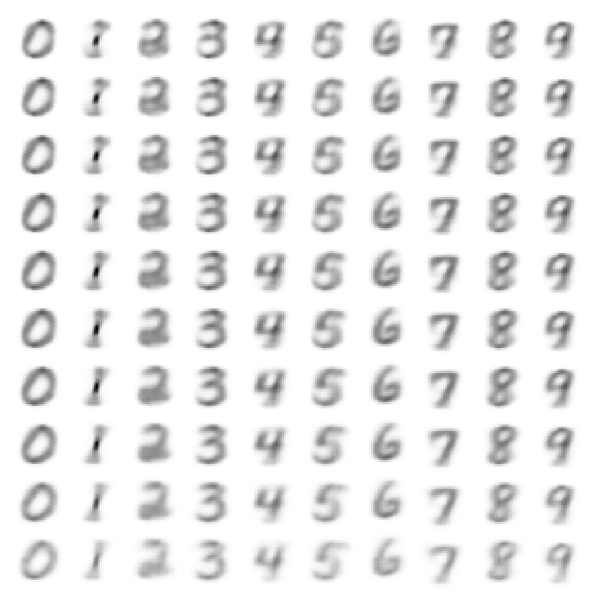

# Conditional VAE
Conditional VAEs can be used to control the content to be generated. In this case, the model can be used to create a specific digit, without figuring out which values you need to put into the code in order to generate them.



## How to Run
Generate code, train and build the EMADL model by executing:

```
bash build.sh
```

Finally, run the generator as follows:
```
bash generate_digit.sh <seed> <digit>
```
where `<seed>` is an integer to randomly sample from the normal distribution to provide values for the latent code.

Assign `<digit>` with the digit you wish to generate.