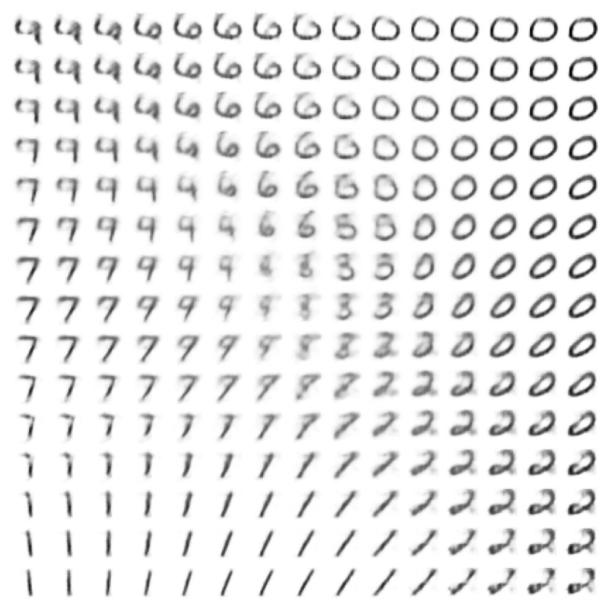

# Variational Autoencoder
VAEs are generative models that are used to generate new data and in this case we generate new handwritten digits. This folder shows an example of the basic VAE architecture framework using a CNN that learns a 2D-latent code.



## How to Run
Generate code, train and build the EMADL model by executing:

```
bash build.sh
```

Finally, run the generator as follows:
```
bash generate_digit.sh <code1> <code2>
```
where `<code1>` and `<code2>` are the values of type double for the 2D-latent code.
(It is more likely to generate meaningful content when choosing values around zero.
The images in the grid were generated by values ranging from -1 to 1. But it is also possible to generate images using a greater range.)
