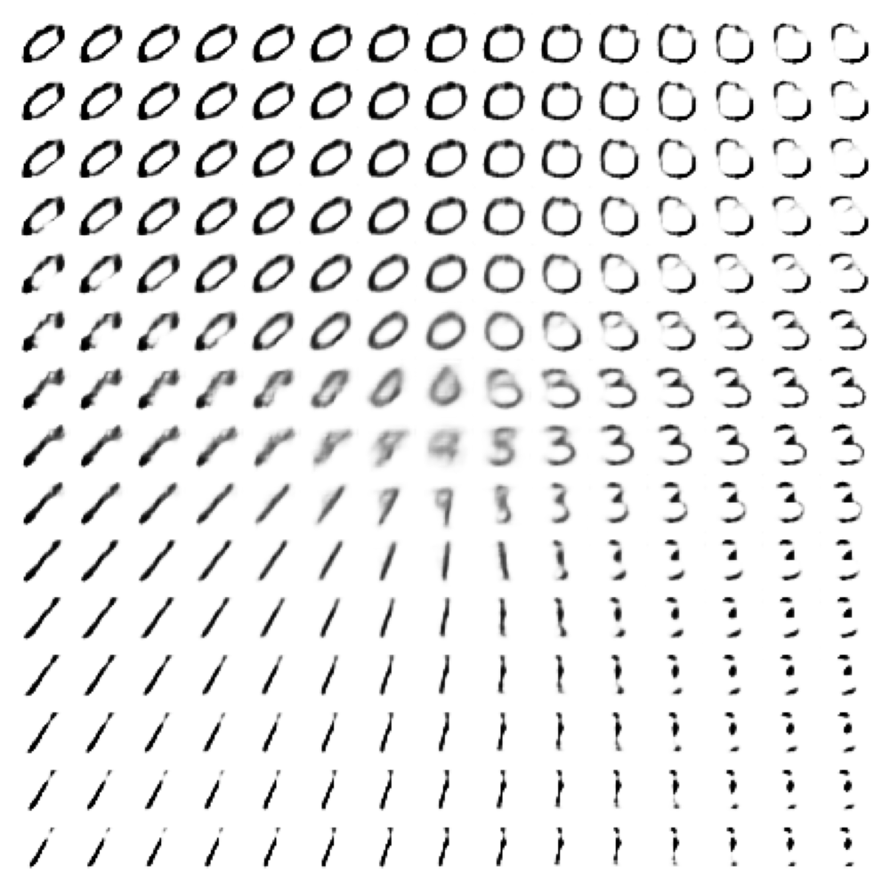

# beta-VAE

beta-VAEs can be used to disentangle the features expressed in the latent code space. We can model them in EMADL by creating a regular VAE and assign a value > 1 to the `kl_loss_weight` Parameter. Here you can see the generated images arranged by the disentangled latent codes that were given to the generator.



## How to Run
Generate code, train and build the EMADL model by executing:

```
bash build.sh
```

Finally, run the generator as follows:
```
bash generate_digit.sh <code1> <code2>
```
where `<code1>` and `<code2>` are the values of type double for the 2D-latent code.

