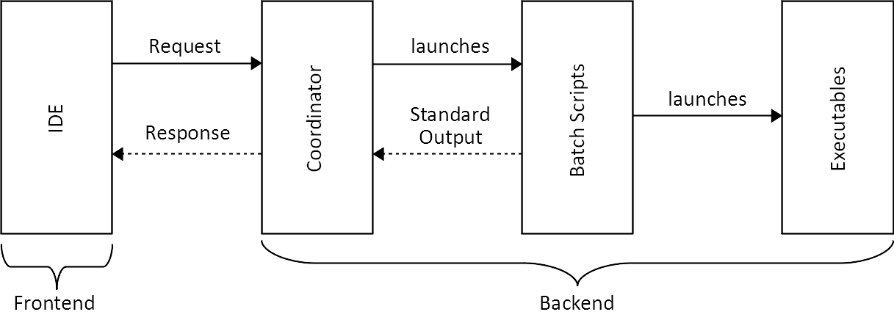
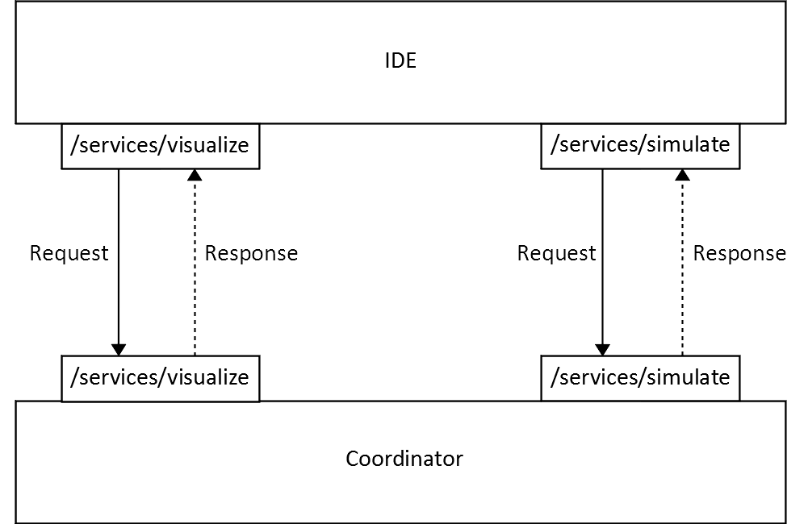
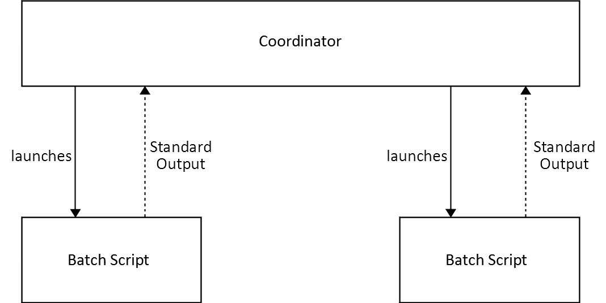
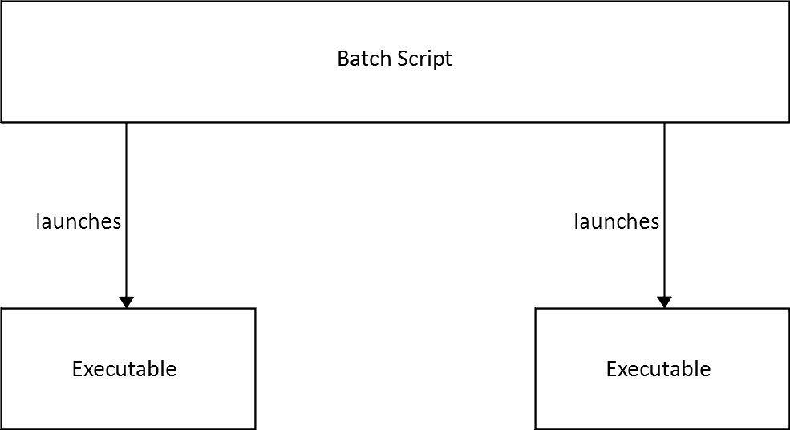
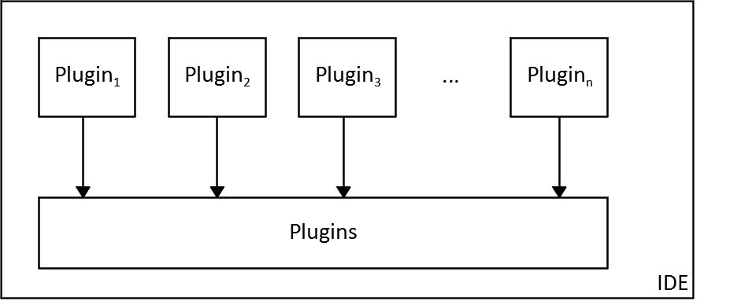
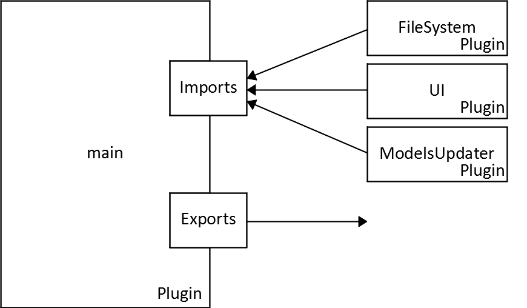
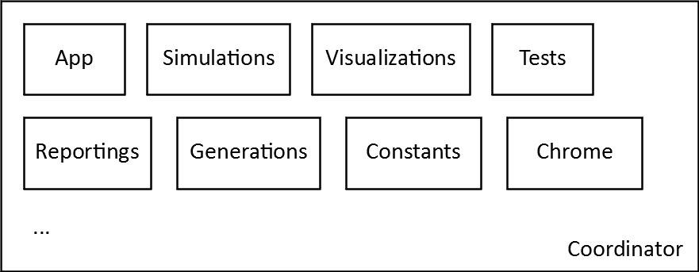
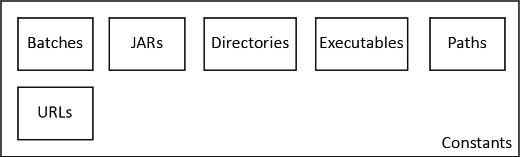
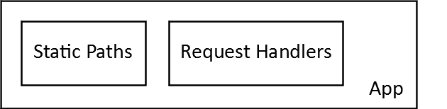

# Developer Guide

## Table of Contents
1. [**Introduction**](#1-introduction)
2. [**Architecture**](#2-architecture)
3. [**IDE**](#3-ide)
4. [**Coordinator**](#4-coordinator)
5. [**Batch Scripts**](#5-batch-scripts)
6. [**Executables**](#6-executables)

## 1. Introduction

## 2. Architecture

Figure 2.1 Overview of EmbeddedMontiArcStudio's architecture.

Figure 2.2 Interaction between IDE and Coordinator.

Figure 2.3 Interaction between Coordinator and Batch Scripts.

Figure 2.4 Interaction between Batch Scripts and Executables.

## 3. IDE

Figure 3.1 Overview of the plugin functionality of the IDE.

Figure 3.2 Overview of the structure of a plugin.

## 4. Coordinator

Figure 4.1 Overview of the structure of the Coordinator.

Figure 4.2 Overview of the included information.

Figure 4.3 Overview of the included settings.

## 5. Batch Scripts

## 6. Executables