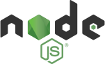
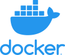

<!-- (c) https://github.com/MontiCore/monticore -->
# Getting Started

## Table of Contents
* [**Prerequisites**](#prerequisites)
* [**Installation**](#installation)
* [**Build**](#build)
* [**Deployment**](#deployment)

## Prerequisites
|  |  |  |  |
| :----: | :-----: | :-----: | :-----: |
| [**1.5.1+**](https://yarnpkg.com) | [**10.14.2**](https://nodejs.org) | [**3+**](https://maven.apache.org/) | [**18.9.3+**](https://www.docker.com/) |

Furthermore, one needs a C++ compiler and a Python 2.7 or 3 distribution for their respective operating system, such as
[**Visual C++ Build Tools**](https://www.visualstudio.com/downloads/#build-tools-for-visual-studio-2017) and
[**Python 2.7**](https://www.python.org/downloads) for Windows.

## Installation
**Requires**: [**Prerequisites**](#prerequisites)

After having downloaded and installed all prerequisites, a developer can clone this repository and continue with the
installation of this project. To this end, a developer has to execute the following console command from within the
root directory or more precisely the directory where `yarn.lock` is located:

```bash
yarn install --ignore-scripts
```

## Build
**Requires**: [**Installation**](#installation)

The main programming languages used for the implementation are [**Java**](https://www.java.com/) and
[**TypeScript**](https://www.typescriptlang.org/). The build process of the artifacts of both languages have been
connected in order to simplify building the repository as a whole. In order to trigger this overall build, a developer
has to execute the following console command from within the root directory:

```bash
mvn -B clean install --settings configs/settings.xml
```

Alternatively, it is also possible to build but a sub-tree of the overall project. To this end, a developer has to
navigate to the respective node within her console and execute the following commands for Java modules and TypeScript
packages respectively:

```bash
mvn -B clean compile --settings <path-to-settings.xml>
```

where `<path-to-settings.xml>` should be replaced with the relative path to the `settings.xml` located in the `configs`
directory of this repository.

```bash
yarn run prepare
```

However, it should be noted that there are interdependencies between some modules or packages. It is therefore
necessary to build them in the correct order. This is currently only automatically handled in the overall build.

## Deployment
**Requires**: [**Build**](#build)

In order to make the artifacts available to the different repositories using this project, they are deployed to
their respective registry / repository. To trigger deployment, a developer has to execute the following
console command from within the root directory:

```bash
mvn -B deploy sonar:sonar -DskipTests -Dmaven.install.skip=true --settings configs/settings.xml
```

However, it should be noted that in order to deploy artifacts from a local machine, it is necessary to have credentials
for the different artifact registries / repositories.
