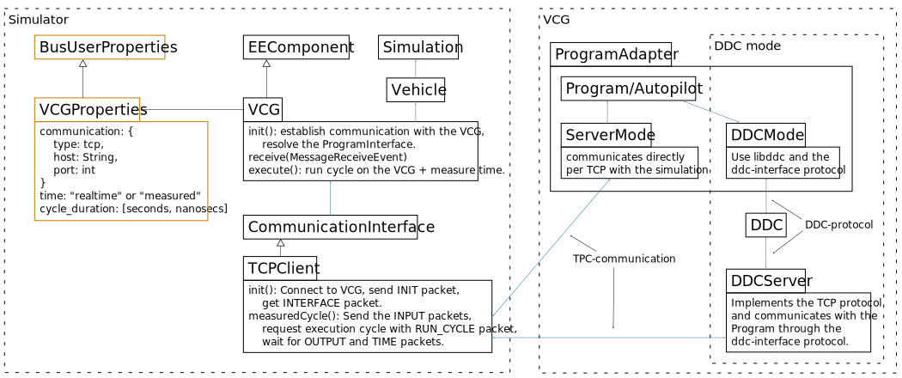

# DDC-interface

A protocol for the communication between Simulation and VCG programs, going through the DDC.

The communication pathway can be seen here:

## The DDC

The Diagnostic Data Cache (DDC) can be seen as a buffer for all programs on the VCG. It is synchronized with semaphores and shared between all processes on the VCG (if they load the same DDC instance).

The simulation stores and reads the values for the ports of the Program in the DDC. The Program can then access and write those using **libddc**.

## Interface types

Describes which ports are used, their data types and where they are stored in the DDC.

- **basic**: A hardcoded set of inputs and outputs for the VCG inside the simulation.
- **dynamic**: The Program on the VCG provides a "dynamic-interface" description for the simulator, which allows the Program to have custom input and output ports.

## Time Modes

- **measured**: The simulation requests the VCG to run one Program cycle and to measure the execution time of the cycle. The simulation thus does not run in real-time.
- **realtime**: The simulation streams and reads the inputs and outputs to the VCG, which runs the Program in a real time loop. The simulation is synced to real-time.

---

## Protocol

The simulator and the Program on the VCG must both receive a shared **reference_id**. This is an offset in the DDC table for **all the following values**.

**The Program must initialize all entries**. (Inputs are optional, but better to reset for clarity). The unused values in between can be set to "empty"/"no data" for clarity.

| Id (+reference_id) | Type | Name | Description |
| --- | --- | --- | --- |
| 0 | bool | running | *See below*.
| 1 | String | interface_type | `"basic"` or `"dynamic"`.
| 2 | String | time_mode | `"measured"` or `"realtime"`. **This entry is set by the simulator**. (For now only `measured`.)
| 3 | bool | run_cycle_switch | **This entry is for the `"measured"` mode only**: see *Measured Mode* below.
| 4 | double | delta_sec | **This entry is for the `"measured"` mode only**: Simulation time increment since last run cycle.
| 5 | double | execution_time | **This entry is for the `"measured"` mode only**: see *Measured Mode* below.
| 6 | bool | simulation_running | **This entry is for the `"realtime"` mode only**: `true` if the simulation is currently running, `false` if not. (The Program should idle if not.)

### The `running` entry

Notifies to the simulator that a Program is running. Must be set to `true` when the Program is running. Try to set it back to `false` when stopping the program (with a signal callback). Since it might be left at `true` when a Program is interrupted, the simulator sets it back to `false` on initialization and waits for it to be set back to `true` by the program (with a timeout). **Thus: check the value every run cycle in the program and set to 1**.

### The Measured Mode

The Program waits for the `run_cycle_switch` entry to be set to `true` (by the simulator). When so, all the inputs have been updated by the simulator. The Program must:

- Run one update cycle.
- Measure its execution time and write it to `execution_time`.
- Update all its outputs.
- Set `run_cycle_switch` back to `false`.

---

## Protocol for the `basic` interface

If the `interface_type` is set to `"basic"`, the following entries are also read/set by the simulator.

| Id (+reference_id) | Type | Name | Description |
| --- | --- | --- | --- |
| 7 | int | input_start_id | The offset from `reference_id` at which the inputs are stored. (Default: `10`)
| 8 | int | output_start_id | The offset from `reference_id` at which the outputs are stored. (Default: `40`)

### Inputs

These are set by the simulator on incoming communication messages.

| Id (+reference_id) | Type | Name | Description |
| --- | --- | --- | --- |
| `input_start_id` + 0 | double | true_velocity | Velocity in km/h along the vehicle front axis.
| `input_start_id` + 1 | double | true_position.x | X coordinates of the COG of the vehicle (in meters).
| `input_start_id` + 2 | double | true_position.y | Y coordinates of the COG of the vehicle (in meters).
| `input_start_id` + 3 | double | true_compass | Deviation in degrees from the X axis / West of the vehicle "front" vector, counter-clockwise.
| `input_start_id` + 4 | int | trajectory_length | Number of set entries in the following `trajectory_x` and `trajectory_y` arrays.
| `input_start_id` + 5 to 14 | double | trajectory_x | (Currently) up to 10 positional entries for the desired trajectory. These points are split into the `trajectory_x` and `trajectory_y` arrays. This trajectory in generated by the `Navigation` component and is not refined (corresponds to OSM nodes).
| `input_start_id` + 15 to 24 | double | trajectory_y | See `trajectory_x`.
| `input_start_id` + 25 | double | steering | Feedback of the `steering` actuator.
| `input_start_id` + 26 | double | gas | Feedback of the `gas` actuator.
| `input_start_id` + 27 | double | braking | Feedback of the `braking` actuator.

### Outputs

These are set by the Program and are sent in the Vehicle after a Program cycle.

| Id (+reference_id) | Type | Name | Description |
| --- | --- | --- | --- |
| `output_start_id` + 0 | double | set_steering | The desired steering angle. Corresponds to the wheel angle. Positive is "to the left" ("counter-clockwise from above"). In **degrees**, currently between `-30` and `30` deg.
| `output_start_id` + 1 | double | set_gas | The gas pedal output. Between `-0.5` (going backwards) and `1.0` (maximum acceleration forward).
| `output_start_id` + 2 | double | set_braking | The brake pedal output. Between `0` (no braking) and `1.0` (maximum braking).

---

## Protocol for the `dynamic` interface

If the `interface_type` is set to `"dynamic"`, the following entries are also read/set by the simulator.

| Id (+reference_id) | Type | Name | Description |
| --- | --- | --- | --- |
| 7 | int | slot_table_start | The offset from `reference_id` at which the slot table starts.
| 8 | int | description_size | Number of following String entries that make up the "ProgramInterface" string. It is split up this way due to the limitation of 200 bytes per DDC entry.
| 9 to 9+description_size-1 | String | interface_string | Chunks of the "ProgramInterface" string.

### The ProgramInterface string

The `ProgramInterface` is a Java Class part of the [DynamicInterface concept](https://git.rwth-aachen.de/monticore/EmbeddedMontiArc/simulators/commons/-/tree/master/src/main/java/de/rwth/montisim/commons/dynamicinterface) (MontiSim -> Commons project) describing the input and output ports of a Program interacting with the simulator. (More specifically the inputs and outputs of an `EEComponent`.)
The `ProgramInterface` string / `interface_string` is the JSON serialization of this class.

TODO example.
TODO link to docu.

The DDC limits the number of bytes per entry to 200, so the string has to be split up in 199 character (+termination character) chunks maximum. The simulator then simply concatenates the chunks together to get the complete string back.

### The Slot Table

Since the available ports are variable in size, the slot table aims at making the exchange of data more robust by specifying the exact offset from `reference_id` for the data of each port.

Starting from (`reference_id` +) `slot_table_start`, the relative id is specified for every port in order of appearance in the "ProgramInterface" string.

| Id (+reference_id) | Type | Name | Description |
| --- | --- | --- | --- |
| `slot_table_start` + i | int | slot_offset_i | The offset **from `reference_id`** for the data of port *i*.

### Data Slots

The following table shows how the different data types are written to the DDC. Some data types can use more than one DDC entry (ex: Arrays).

| DataType | DDC Type |
| --- | --- |
| `BasicType.DOUBLE`, `BasicType.Q` | `double` (1 DDC entry) |
| `BasicType.INT`, `BasicType.Z`, `BasicType.N`, `BasicType.N1` | `int32_t` (1 DDC entry) |
| `BasicType.BOOLEAN` | `bool` (1 DDC entry) |
| `BasicType.C`  | 2 consecutive `double` DDC entries.
| `BasicType.VEC2`  | 2 consecutive `double` DDC entries.
| `BasicType.VEC3`  | 3 consecutive `double` DDC entries.
| `VectorType` | `vector_size * type_size` consecutive DDC entries.
| `MatrixType` | `rows * columns * type_size` consecutive DDC entries. Order: row after row consecutively.
| `StructType` | Each field consecutively in declaration order.
