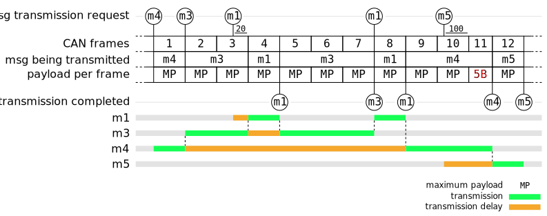

[//]: # (These documents are best viewed in their formatted form, e.g. in the online gitlab file viewer.)

# EESimulator

> *__EE__ comes from "Electrical & Electronic Systems"*

The `EESimulator` sub-project handles the transmission and processing of **discrete events** inside a vehicle. These discrete events mainly have the form of **messages** between **ee-components** across communication **buses**.

## Usage

Users of this sub-project can either instance the `EESimulator` as part of their vehicle or inherit the `EEComponent` class to create new components that work inside the ee-vehicle.

To setup an ee-system, create an `EESimulator`.
Then create the required `Bus`, `EEComponent` & `Bridge` instances.
Components and bridges can then be linked to buses (with `connectToBus()`) using the bus object, its _component-id_ or its name.
A component or bridge can be connected to multiple buses.

> _**Note**: no cyclic bus/bridge structures are allowed._

When all components are connected, call `simulator.getComponentManager().finalizeSetup()`.
This will check the routing validity between components and setup the optimized routing data-structures.

## Structure

EESimulator: extends a DiscreteEventSimulator.

EEEventProcessor: registers at the EESimulator.

The `EESimulator` contains a `ComponentManager` and a `MessageTypeManager`

## Buses

### ConstantBus

### CAN

## Tests

### CANTest

Messages used in the different CAN tests:

| Message | Size (bits) | Priority |
| ------- | ------------|:--------:|
| **m1**  | _MP_        | 1        |
| **m2**  | 3           | 2        |
| **m3**  | 5*_MP_      | 3        |
| **m4**  | 3*_MP_ + 5  | 4        |
| **m5**  | _MP_        | 5        |

> _MP_ is for "**Max Payload**", the maximum number of payload bits in one frame.

### Performed tests

- **fullFrameMsg()**: send _m1_.
- **partialFrameMsg()**: send _m2_.
- **multiFullFrameMsg()**: send _m3_.
- **multiPartialFrameMsg()**: send _m4_.
- **multiMsgsInTime()**: send _m1_ to _m4_, spaced in time (no overlap).
- **multiMsgsAtSameTime()**: send _m1_ to _m4_ at the exact same time (test priorities).
- **multiMsgsOverlappingTime()**: send _m1_ to _m5_ at overlapping time (test partial transmissions and transmission resume, see next section).

### multiMsgsOverlappingTime()

The following shows the expected behavior for the `multiMsgsOverlappingTime()` test. Note that the inter-frame spaces are not shown in the graph but have an impact on how the expected times have to be computed. (The *completion time* doesn't include the inter-frame space necessary to start transmitting the next frame.)

## TODO

- Usage
- Structure
- Buses
- Tests
