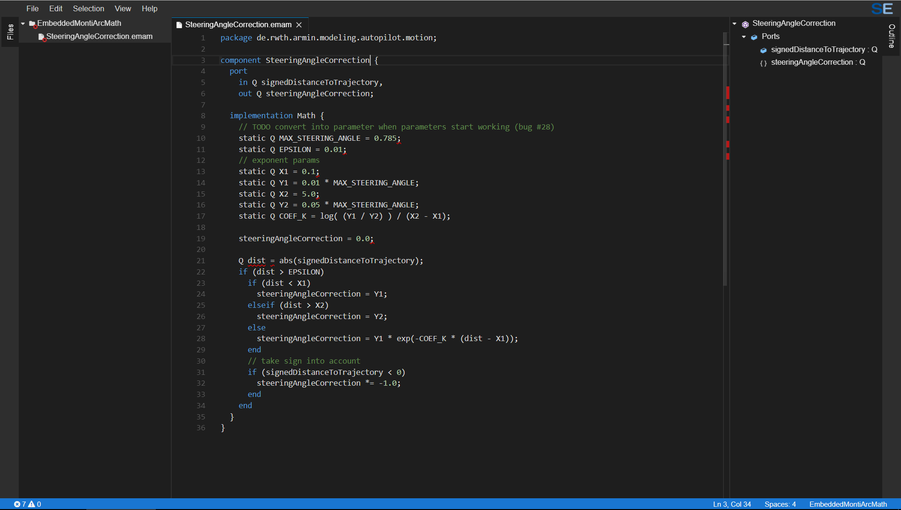

# EmbeddedMontiArcMath

    
    

    

## Description
To be written.

## References
To be added.

<!-- ## Application Programming Interface
The API documentation for this module can be found
[here](https://embeddedmontiarc.github.io/Elysium/plugins/embeddedmontiarcmath/docs). -->