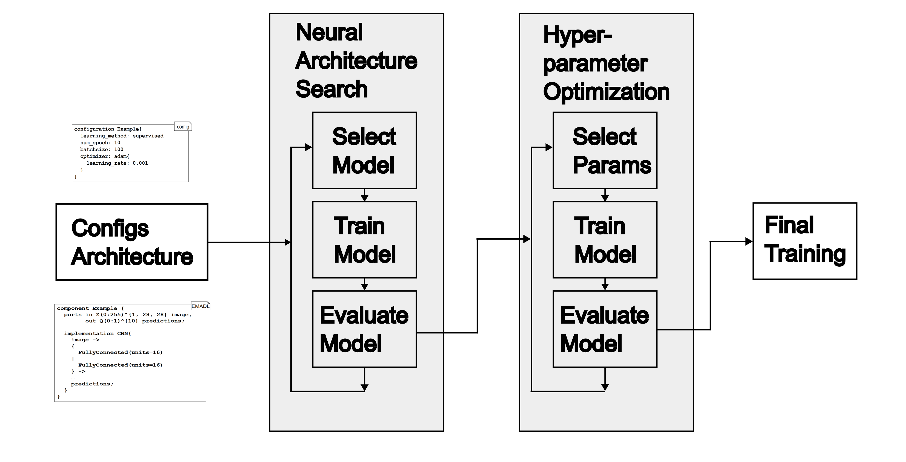

# AutoML

## Introduction

As one of the workflow steps, the AutoML pipeline executes the needed steps to get a trained model with the
best hyperparameters, and that without interaction with the user.
From the workflow, it receives the following data:

- The starting model: The model that is used as a starting point for the NAS. This includes AST and symbol table.
- The training pipeline
- The training pipeline configuration
- The NAS configuration
- The hyperparameter optimization configuration



The execution of the AutoML pipeline starts with the NAS step and follows with the hyperparameter optimization step,
which is shown in \autoref{fig:automl-pipeline}.
The training pipeline used by the NAS and hyperparameter optimization steps is the same.
It gives the autoML pipeline the possibility to use different training backends.

The NAS step typically uses an iterative approach.
In each iteration, the algorithm creates a new model, trains it using the training pipeline and training pipeline
configuration, and evaluates it.
If the current model fulfills the estimation goal, the pipeline stops and returns it.
Otherwise, it continues with the next iteration.
After n iterations, the pipeline returns the best model found in the n iterations, even if the best model does not
fulfill the estimation goal.

The hyperparameter optimization step structure is similar to the NAS step and uses an iterative approach.
In each iteration, the selected algorithm selects new hyperparameters.
It then trains the model found by the NAS step with the new hyperparameters and evaluates it.
If the current hyperparameter configuration fulfills the estimation goal, the pipeline stops and returns it.
Otherwise, it continues with the next iteration.
If the algorithm cannot find hyperparameters that fulfill the estimation goal within n iterations, it returns the best
hyperparameters found in the n iterations.

In the end, the pipeline trains the found model of the NAS step with the found hyperparameters of the hyperparameter
optimization step.
Since both NAS and hyperparameter optimization steps need to train multiple model/hyperparameter combinations, this can
take a long time.
Both steps only perform training up to a certain number of epochs to speed up training.
The final training step can train the model with more epochs to get a better-trained model.
The result of the final training step is the final model.

## Usage

The starting point for the AutoML pipeline is the class AutoMLCli which contains a main method.
This class starts an AutoMLWorkflow instance which itself loads all needed configurations and starts the AutoML
pipeline.
To set the path for the configuration files, the AutoMLCli class expects the path to the configuration files as a
command-line argument.
An example for the starting arguments is shown below:

```bash
-m src/main/resources/adanet_experiment/emadl/ -r mnist.MnistClassifier -o target -b PYTORCH -f n -c n
```

As Java version, you need to use Java 8,

## Configuration

In main/resources/adanet_experiment/emadl/mnist you can find the configuration files for our AutoML pipeline experiment.
The model is defined in the files

- MnistClassifier.emadl (Root model)
- AdaNetCustom.emadl (AdaNet model, used by MnistClassifier.emadl)
- ArgMax.emadl (Helper model, used by MnistClassifier.emadl)

All configuration files are in the MnistClassifier folder.
Important files are:

- AdaNet.conf (AdaNet configuration, if EfficientNet ist used, use an EfficientNet.conf file instead)
  - To skip Neural Architecture Search Step: Remove both AdaNet.conf and EfficientNet.conf file and use a fixed
  architecture (example: LeNetNetwork.emadl)
- HyperparameterOpt.conf (Hyperparameter optimization configuration)
  - Definition of hyper-hyperparameters is optional (if a value for a hyper-hyperparameter is not defined a default
  value is used)
  - To skip Hyperparameter Optimization step: Remove HyperparameterOpt.conf file
- mnistClassifier_net.conf (Training pipeline configuration)

