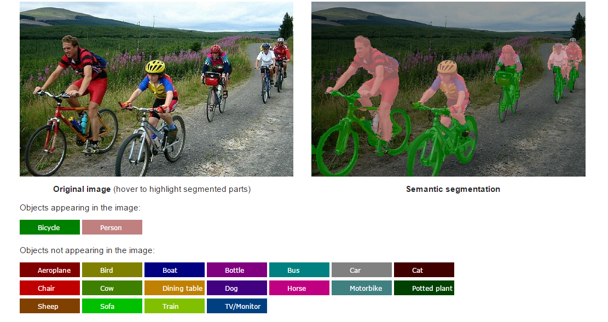

# CRF-RNN for Semantic Image Segmentation - Keras/Tensorflow version

<b>Live demo:</b> &nbsp;&nbsp;&nbsp;&nbsp; [http://crfasrnn.torr.vision](http://crfasrnn.torr.vision)  
<b>Caffe version:</b> [http://github.com/torrvision/crfasrnn](http://github.com/torrvision/crfasrnn) 

This repository contains gluon/mxnet code for the "CRF-RNN" semantic image segmentation method, published in the ICCV 2015 paper [Conditional Random Fields as Recurrent Neural Networks](http://www.robots.ox.ac.uk/~szheng/papers/CRFasRNN.pdf). This paper was initially described in an [arXiv tech report](http://arxiv.org/abs/1502.03240). The [online demo](http://crfasrnn.torr.vision) of this project won the Best Demo Prize at ICCV 2015. Original Caffe-based code of this project can be found [here](https://github.com/torrvision/crfasrnn).
This gluon/mxnet code is based on the implementation on a [keras implementation by sadeepj](https://github.com/sadeepj/crfasrnn_keras).

