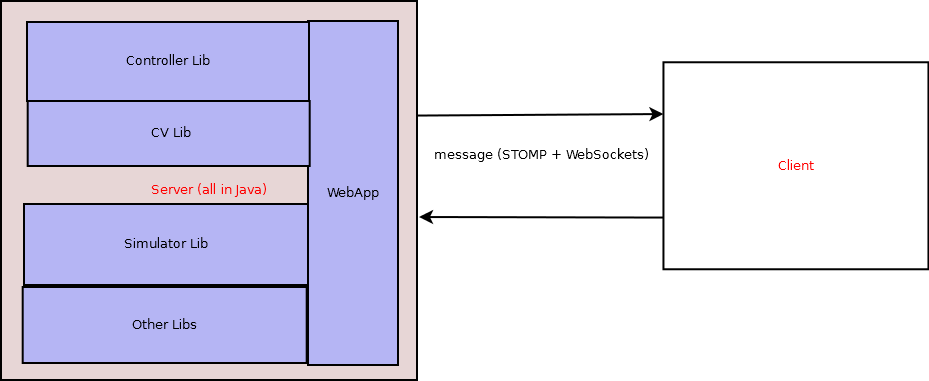
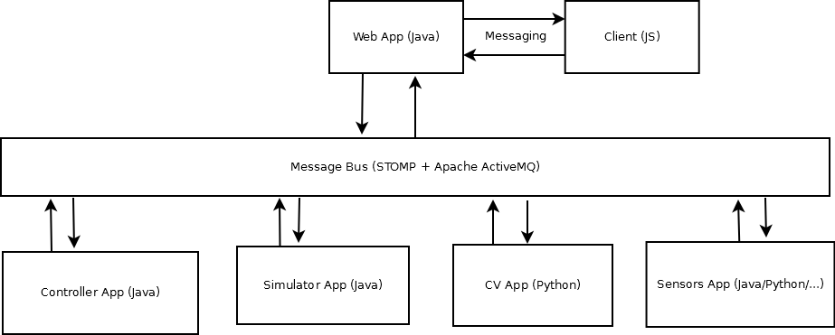

<!-- (c) https://github.com/MontiCore/monticore -->
# Technology Stack of The Project (DRAFT)

## Back-End Technologies

* Framework: Spring MVC 4.x.
* Communication with client: [STOMP](http://jmesnil.net/stomp-websocket/doc/) messaging over WebSockets with fallback options to long polling (managed by the library [SockJS](https://github.com/sockjs/sockjs-client)).
Client will receive messages and react to them (rerender the scene).
It will also send screenshots to server via messages.
* REST API is also possible.
The question is whether we really need it or not.
REST API could be used for "one-time" operations like initialization, starting simulation etc.
Although they also can be done via messaging.
* Server: Apache Tomcat 8.x for PROD and Jetty 9.x for DEV (both support WebSockets).

## Front-End Technologies

* Three.js
* Vanilla JS

## System Architecture

There are 2 options:
* Without messaging across the system:

WebApp plays role of a mediator which "glues" different pieces together (Controller, CV, Simulator, Sensors etc.).
    * Benefits: relatively simple and straightforward to implement.
    * Drawbacks: not that flexible (everything must be developed in Java), monolithic.
* With messaging across the system:

Each app is completely separate from others and can be developed in its own programming language (Java, Python, C/C++ etc.).
Interaction is based on data exchange (messages).
    * Benefits: flexible.
    * Drawbacks: complex, hard to debug, single point of failure -- message broker (e.g. Apache ActiveMQ).
