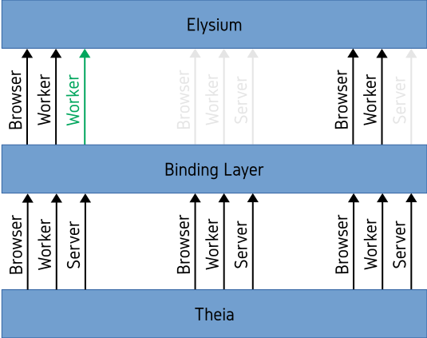

    
    

    

## Table of Contents
* [**Description**](#description)
* [**Getting Started**](/doc/GettingStarted.md)
* [**Packages**](../../packages/standalone)
* [**Extensions**](../../extensions/standalone)
* [**Browser Support**](#browser-support)

## Description
Online IDEs in general suffer of a certain set of disadvantages compared to Offline IDEs. In
Communication Systems Engineering, there are particular properties that a communication system
has to fulfill in order to be regarded as of high-quality. Four of these properties are *secure*,
*private*, *reliable* and *scalable*. From a user's point of view, an Online IDE should adhere to
the same criteria. An Online IDE should be reliable in the sense that it (semi-)autonomously
detects failure of the system and recovers from such a state. This is necessary as a user cannot
just restart her PC in order to restore the functionality of the system. Then, an Online IDE
should be secure and private in the sense that the files of the workspaces are protected against
loss and the curiosity of other parties. Finally, it should be scalable in the sense that a large
amount of users should be able to simultaneously use the Online IDE without negatively influencing
each other.

While careful Software Engineering can account for the reliability of a system, privacy is more
often than not addressed on a much lower level with the use of virtualization technologies. The
advantage of virtualization in this context is the sandbox behavior of the different instances
of the guest system which guarantees (to a certain degree) that the files of a user's workspace
are protected against theft. Security is addressed in a similar fashion with the introduction
of a backup mechanism in combination with Cloud Technologies which create a certain amount of
redundancy protecting against loss of a user's files in the worst case scenario. Lastly,
scalability is also addressed using Cloud Technologies as it enables the possibility to
increase the available hardware resources on demand if the need should arise.

All these solutions are valid in their own right and are probably necessary to provide a
fully-fledged Online IDE which adheres to the previously mentioned criteria. Most definitely
it also holds true that if one has the opportunity to put these solutions into place it is
probably the recommended procedure. However, most of the depicted actors (Hypervisor Software,
Cloud Provider, ...) are expensive and generally not affordable by small startups which makes
Online IDEs less attractive.

At the core of the aforementioned disadvantages lies an Online IDE's server component whose
necessity comes from the restrictions imposed on the web browser. However, depending on the
use case, one might not need the full spectrum of functionality offered by the IDE. As a
consequence, these restrictions are less severe and allow for a client-focused implementation.
One of these favorable use cases is the presentation of and development on DSLs, the focus
area of Elysium in Standalone Mode.

In order to extend Theia by a mode with less functionality but which does not need a server
component, Elysium makes use of Theia's architecture. The fact that InversifyJS has been used
as IoC container for the implementation means that components can be bound, unbound and
rebound before the actual execution of the IDE. Elysium makes use of this fact and extends
the architecture by adding new features and removing or replacing functionality which
would normally need a server component. A representation of this extension can be seen in
Figure 1.

    

    Figure 1. Representation of the binding layer between Elysium Standalone and Theia.

## Browser Support
|  |  |  |  |  |  |
| :--------------------: | :--------------------: | :--------------------: | :--------------------: | :--------------------: | :---: |
| 57+ :heavy_check_mark: | 52+ :heavy_check_mark: | 11+ :heavy_check_mark: | 44+ :heavy_check_mark: | 16+ :heavy_check_mark: | :x:   |

|  |  |  |
| :----------------------: | :---------------------------------------: | :-------------------------------: |
| :heavy_check_mark:       | :x:                                       | :x:                               |
