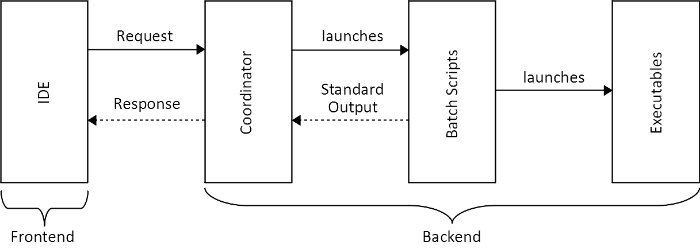
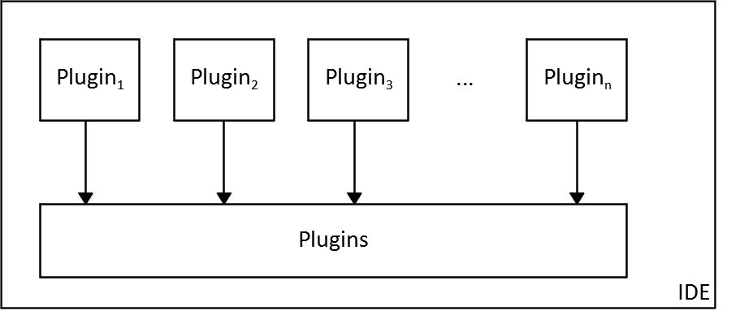
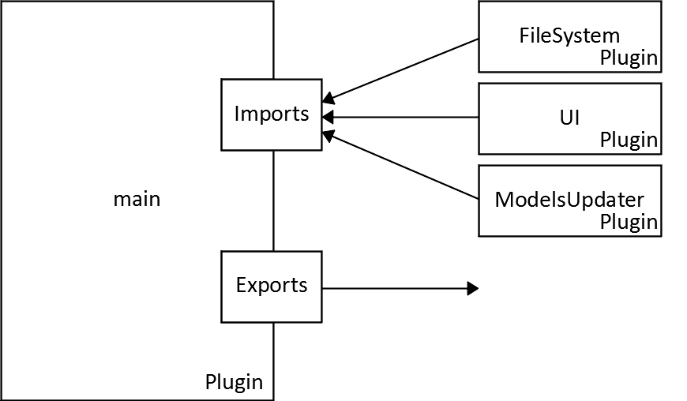
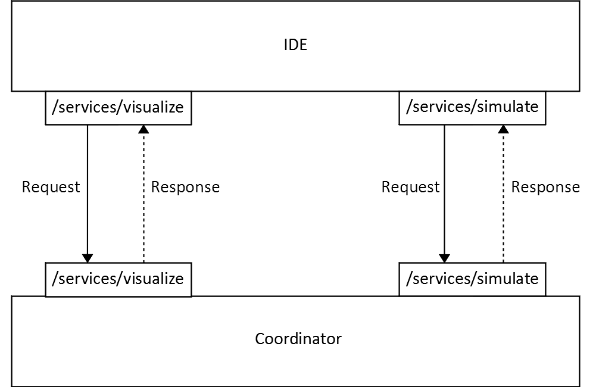
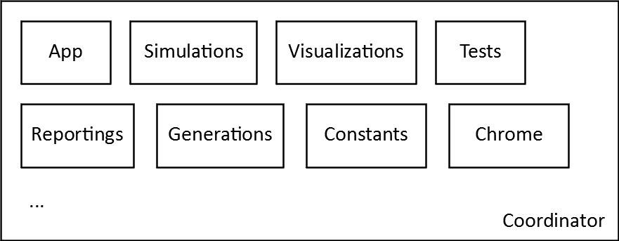
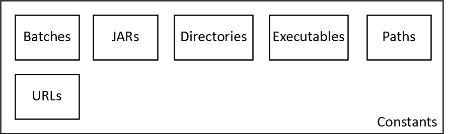
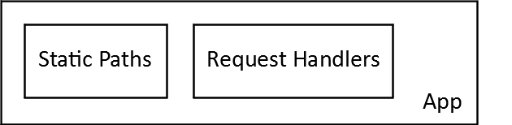
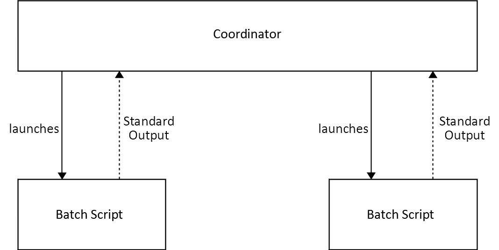
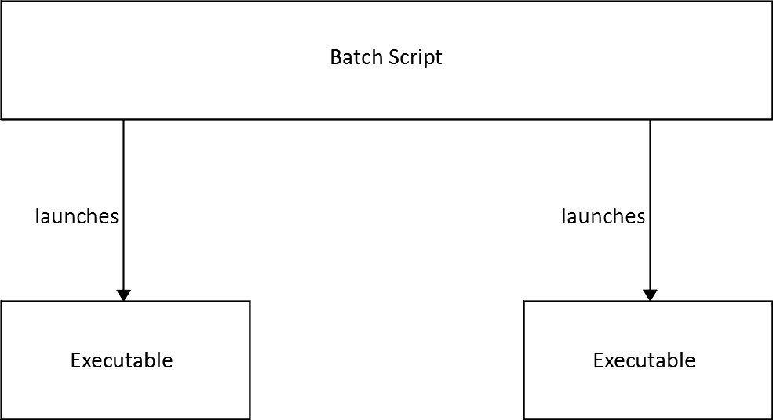

<!-- (c) https://github.com/MontiCore/monticore -->
# Developer Guide


## Table of Contents
1. [**Introduction**](#1-introduction)
2. [**Architecture**](#2-architecture)
3. [**IDE**](#3-ide)
4. [**Coordinator**](#4-coordinator)
5. [**Batch Scripts**](#5-batch-scripts)
6. [**Executables**](#6-executables)
7. [**Models**](#7-models)
8. [**Scenario**](#8-scenario)
9. [**Frequently Asked Questions**](#9-frequently-asked-questions)

## 1. Introduction
EMAStudioBuilder, as the name suggests, is the project responsible for building
EmbeddedMontiArcStudio.

EmbeddedMontiArcStudio is a collaborative effort of the EmbeddedMontiArc subgroup which binds
together most if not all of the projects created by the group's developers. It acts as
Integrated Development Environment (IDE) for MontiCAR, a Domain-Specific Language (DSL) family
for the architectural and behavioral description of cyber-physical systems, such as
autonomously driving vehicles.

Due to the large variety of different projects which have been or will be integrated into
EmbeddedMontiArcStudio and which range from Java to C++ applications with a multitude of
different dependencies, EmbeddedMontiArcStudio has been developed with generality in mind. As
a consequence, however, there has been an increase in complexity with respect to the
integration of new projects and this can be quite overwhelming for new developers. This
developer guide aims at compensating for this fact by depicting the most important actors and
the necessary steps to integrate a new project.

## 2. Architecture


Figure 2.1 Overview of EmbeddedMontiArcStudio's architecture.

## 3. IDE


Figure 3.1 Overview of the plugin functionality of the IDE.



Figure 3.2 Overview of the structure of a plugin.

## 4. Coordinator


Figure 4.1 Interaction between IDE and Coordinator.



Figure 4.2 Overview of the structure of the Coordinator.



Figure 4.3 Overview of the information included in Constants.



Figure 4.4 Overview of the settings included in App.

## 5. Batch Scripts


Figure 5.1 Interaction between Coordinator and Batch Scripts.

## 6. Executables
As established in the previous section, the Coordinator executes Batch Scripts designed to
prepare and execute an integrated project. In order to achieve this, these scripts make use of
installed executables. Available executables are, amongst others, the executables provided by
the Operating System, but also executables installed as dependencies for EmbeddedMontiArcStudio,
such as java or g++. An overview of this can be seen in Figure 6.1.

In order to add an executable as dependency, a developer has to add an entry to
[`dependencies.txt`](https://git.rwth-aachen.de/monticore/EmbeddedMontiArc/utilities/EMAStudioBuilder/blob/master/dependencies.txt#L31)
which links to a ZIP archive containing the executable and all of its dependencies. Furthermore,
in order to make the executable available as command in batch scripts, one has to add its
parent folder to the
[`PATH`](https://git.rwth-aachen.de/monticore/EmbeddedMontiArc/utilities/EMAStudioBuilder/blob/master/EmbeddedMontiArcStudio/scripts/shared/variables.bat#L16)
environmental variable. Alternatively, one has to specify the relative or absolute path to the
executable.



Figure 6.1 Interaction between Batch Scripts and Executables.

## 7. Models

## 8. Scenario
Imagine that you are in the following situation. You are a developer for the EmbeddedMontiArc
subgroup and you have developed a language called `EmbeddedMontiArcBLA` which is the `BLA`
language embedded into the EmbeddedMontiArc language. BLA stands for **B**iologically
**L**inked **A**rchitecture (what else did you expect?) and is a language for the
architectural description of biological components. Based on this newly created language
(which if I may say so might shape the future of cyber-biological systems), you have developed
a Java application which you called `VisualizationBLA` and which visualizes the links between
different biological components. Like a good Software Engineer, you have created a collection
of EmbeddedMontiArcBLA models which model the behavior of an intelligent exoskeleton
(awesome stuff) in order to test your application (Wait, you did not test your application?
There is still time, I will not tell on you). Your fully functional and tested application
expects three inputs. The first one being the fully qualified name of the main model, namely
`de.rwth.se.Exoskeleton`, the second one being the model path
`C:\Users\Peter\Exoskeleton\input` and the last one being the output path
`C:\Users\Peter\Exoskeleton\output` (Wait, your name is not Peter? Well, it is now). Your
supervisor, the stakeholders (or for whomever you are developing for) like(s) your project.
You are already expecting a good grade or a promotion. Heck, maybe you are already planning on
going on vacation after all that hard work you have done. But hold your horses, life is not
that simple, because you have been given a last task to perform: integrating your project into
EmbeddedMontiArcStudio. Now, that is a scary task if I have ever seen one, but do not worry,
for I will guide you through the necessary steps.

First of all, you will have to ensure that your application runs as standalone application
when started with the `java` executable. In order to do so, you will have to pack it as
Java Archive (JAR) with dependencies. This can be achieved by adding a plugin entry to the
`pom.xml` of your Maven project (Wait, you did not use Maven? Then what are you waiting for,
time to switch). How this entry has to look like can be seen in this
[`pom.xml`](https://git.rwth-aachen.de/monticore/EmbeddedMontiArc/generators/VisualizationEMAM/blob/master/pom.xml#L166).
Executing the `package` step of Maven will now generate a JAR with dependencies into the
`target` folder. You can rename this JAR to whatever descriptive name you can think of, but
for the sake of simplicity, let us assume that you renamed it to `visualization-bla.jar`.

The next step is the creation of a ZIP archive which holds a folder containing the previously
generated JAR with dependencies. Read the previous sentence once more. It is important that
the ZIP archive holds a folder which then holds the JAR and not directly the JAR, because it
will lead to a better structured integration. Therefore, the created ZIP archive should look
like this:

```
/
|-- visualization-bla/
    |-- visualization-bla.jar
```

If you have double-checked everything, you can continue with uploading the ZIP archive to
`Sciebo` (Wait, you do not have access to `Sciebo`? Well, nagging the one in charge has
proven to be quite successful in this kind of situations). After having logged into `Sciebo`,
you should be able to see a directory `dependencies`. In this directory, you need to create
a new directory while respecting the following format `YY.MM.DD-ProjectName`. In your case,
this would be the folder `YY.MM.DD-visualization-bla`. This newly created folder is also the
upload destination for the previously created ZIP archive.

With this, the preparations are completed and we can move to the core of the integration.
In order to do so, you will have to clone this repository. In the root directory, you should
find a `dependencies.txt` which needs to be modified in order to register the previously
uploaded archive as dependency. `dependencies.txt` consists of two different kinds of entries.
The first kind of entries are directories and are marked with a single * as first character
in the line. The second kind of entries are the URLs to the dependencies and are marked with
two ** as first characters in the line. During build, the dependencies will be downloaded and
extracted to the folder under which they have been registered. Let us assume that you want to
have your archive extracted under the root directory. In order to achieve this, you will have
to add the following entry to `dependencies.txt`:

```
* EmbeddedMontiArcStudio\
[...]
** https://rwth-aachen.sciebo.de/s/igDWzLpdO5zYHBj/download?path=%2Fshared%2FYY.MM.DD.visualization-bla&files=visualization-bla.zip
```

<!-- Models -->
The next point on our long checklist is the integration of your amazing Exoskeleton model.
This integration happens in two steps: adding the model and telling the IDE that such a
model exists. Adding the model is rather straightforward. Just create a new directory in
the `model` folder of the root directory and copy your model to this newly created folder.
In the following, let us assume that you named this folder `exoskeleton`. Adding the model
to the registry is slightly more complicated (and hacky to be honest). For this, you will
need to navigate to the folder
[`ide/client/modules/se.rwth.common.dashboard`](https://git.rwth-aachen.de/monticore/EmbeddedMontiArc/utilities/EMAStudioBuilder/tree/master/EmbeddedMontiArcStudio/ide/client/modules/se.rwth.common.dashboard)
and open
[`dashboard.js`](https://git.rwth-aachen.de/monticore/EmbeddedMontiArc/utilities/EMAStudioBuilder/blob/master/EmbeddedMontiArcStudio/ide/client/modules/se.rwth.common.dashboard/dashboard.js#L27).
In the lines 27 and onwards, you can see how other models have been registered in an array.
Analogously, you will have to add an entry to this array. In your case, this entry would look
like this:

```
properties.projects = [{
    username: "EmbeddedMontiArcStudio",
    reponame: "Exoskeleton",
    branchname: "",
    href: "/api/load.html?mountPoint=EmbeddedMontiArcStudio/Exoskeleton/v&url=/m/exoskeleton.zip&openFile=/de/rwth/se/Exoskeleton.emab"
}];
```

<!-- Batch Script -->
<!-- Coordinator -->
<!-- IDE -->

## 9. Frequently Asked Questions
