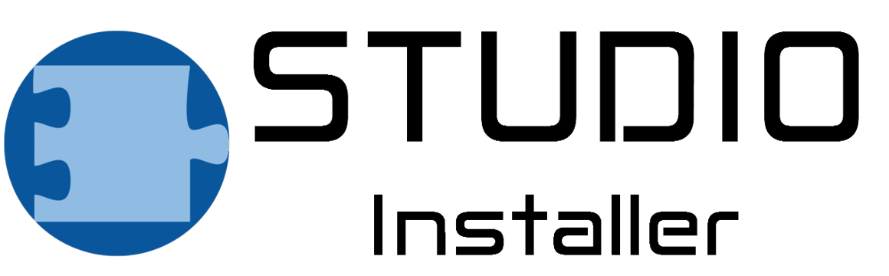

    

    
    
    

- - -

## Table of Contents
* [**Description**](#description)
* [**Getting Started**](doc/GettingStarted.md)
* [**Packages**](packages)
* [**Extensions**](extensions)
* [**Contributing**](doc/Contributing.md)
* [**License**](#license)

## Description
[**EMAStudioInstaller**](README.md) is the successor of
[**EMAStudioBuilder**](https://git.rwth-aachen.de/monticore/EmbeddedMontiArc/utilities/EMAStudioBuilder)([**Linux**](https://git.rwth-aachen.de/monticore/EmbeddedMontiArc/utilities/EMAStudioBuilderLinux)).
In contrast to EMAStudioBuilder, whose aim it was to generate an archive with all components of EmbeddedMontiArcStudio,
EMAStudioInstaller aims at generating a fully-fledged EmbeddedMontiArcStudio application including installer. In order
to achieve this, EMAStudioInstaller makes use of
[**Electron-Builder**](https://github.com/electron-userland/electron-builder) a project which enables the cross-platform
generation of binaries for the installation and execution of [**Electron**](https://electronjs.org/) applications.
Electron-Builder, having been developed for the use in the [**Node.js**](https://nodejs.org/) runtime environment, this
project has also been developed for the same environment. This has the advantage that this project is cross-platform
compatible. As a consequence, only a single repository has to be maintained for all platforms.

## License
Copyright (C) 2018 SE RWTH.

A concrete license is to be discussed.