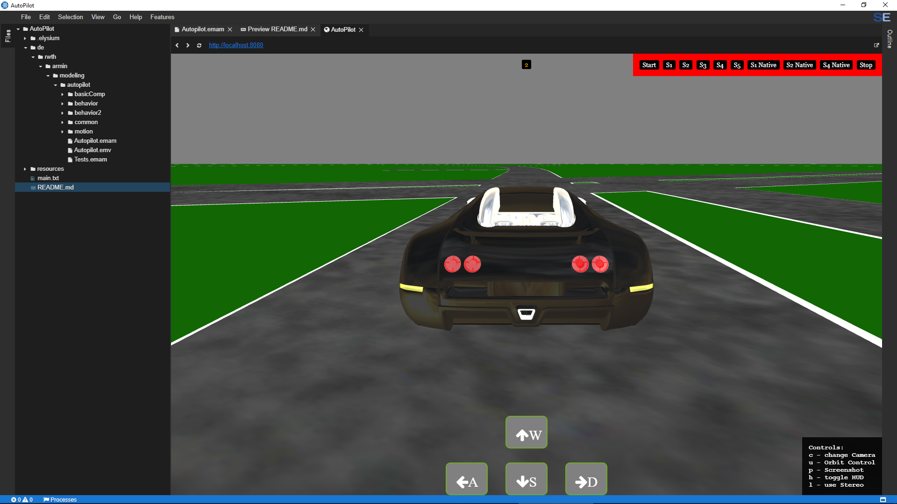
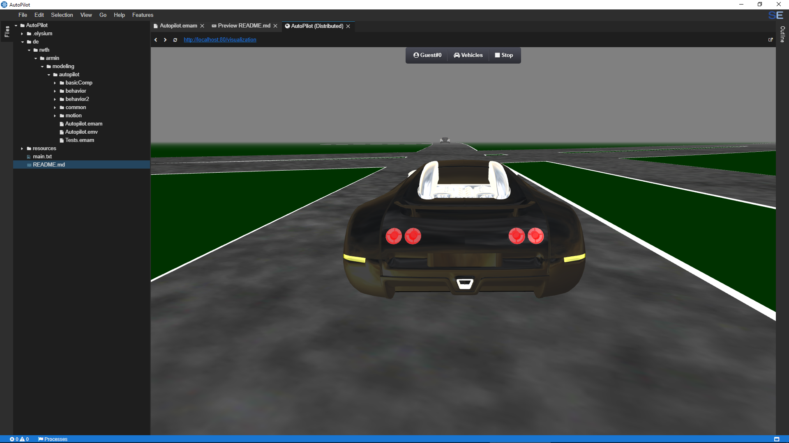

# AutoPilot

    

|  | 
| :---: | :---: |
| AutoPilot | AutoPilot Distributed |

## Description
To be written.

<!-- ## Application Programming Interface
The API documentation for this module can be found
[here](https://embeddedmontiarc.github.io/Elysium/packages/workspace/docs). -->