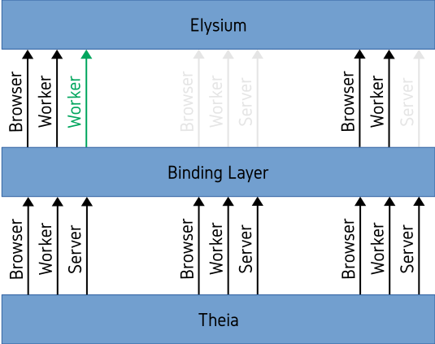

    
    

    

## Table of Contents
* [**Description**](#description)
* [**Getting Started**](doc/GettingStarted.md)
* [**Packages**](packages)
* [**Extensions**](extensions)
* [**Development Team**](doc/DevelopmentTeam.md)
* [**Browser Support**](#browser-support)
* [**Contributing**](doc/Contributing.md)
* [**License**](#license)

## Description
Nowadays, one of the most commonly used type of languages besides natural ones are programming
languages. Programming Languages act as instrument for the instruction of an information
system. Comparable to the dialects of natural languages, programming languages also come in
different flavors which range from imperative to object-oriented. Despite the sheer amount of
programming languages which have been developed over the course of the last decades, most of
them were not used in a single area of application. For this reason, programming languages are
often also categorized under *General Purpose Languages* (GPLs).

With the increasing prominence of GPLs due to the digitalization of our everyday life,
developers made a few observations. Designing a business system used to be a cooperation
between software developers and domain experts where the former would bring the necessary
technical expertise whereas the latter would bring the necessary knowledge about the domain
and would support the former in their task of the system's creation. The reason for this
strict separation of the two worlds is due to the fact that neither know enough about the
other's area of expertise to take over the other's part. Nonetheless, a deeper involvement of
the domain experts would dramatically increase the system's quality. For this reason, a
different kind of languages have made their appearance known under the name of
*Domain-Specific Languages* (DSLs).

DSLs are mostly constituted of a specific domain's vocabulary and are therefore often easier
to understand and to learn for a domain expert which enables a deeper involvement in the
development process. The models of a DSL can then be further processed and translated into
other languages. Therefore, there is an abstraction layer between the domain and the technical
aspects of the system.

**Elysium** is an Online IDE whose primary focus lies on the _client-side focused_
demonstration of and development on textual DSLs created with the language workbench
[**MontiCore**](http://www.monticore.de).

In order to achieve this goal, Elysium uses a different project as its foundation called
[**Theia**](http://www.theia-ide.org). As of this writing, Theia is the only IDE which is both
capable of running as fully fledged Online IDE on a server and as completely autonomous Offline
IDE on a PC. This is made possible due to its well-designed architecture which makes use of
state-of-the-art _Inversion of Control_ (IoC) and _Dependency Injection_ (DI) principles. Theia
itself has been developed using [**TypeScript**](https://www.typescriptlang.org) as programming
language, which is a language whose generated JavaScript files are capable of both being
executed in an online environment provided by [**Node.js**](https://nodejs.org) as server and a
browser as client component as well as in an offline environment provided by
[**Electron**](https://electronjs.org). Theia's architecture is fueled by
[**InversifyJS**](http://inversify.io), a powerful IoC framework for TypeScript and/or
JavaScript.

Nonetheless, Online IDEs in general suffer of a certain set of disadvantages compared to
Offline IDEs. In Communication Systems Engineering, there are particular properties that a
communication system has to fulfill in order to be regarded as of high-quality. Four of these
properties are *secure*, *private*, *reliable* and *scalable*. From a user's point of view,
an Online IDE should adhere to the same criteria. An Online IDE should be reliable in the
sense that it (semi-)autonomously detects failure of the system and recovers from such a state.
This is necessary as a user cannot just restart her PC in order to restore the functionality
of the system. Then, an Online IDE should be secure and private in the sense that the files of
the workspaces are protected against loss and the curiosity of other parties. Finally, it
should be scalable in the sense that a large amount of users should be able to simultaneously
use the Online IDE without negatively influencing each other.

While careful Software Engineering can account for the reliability of a system, privacy is more
often than not addressed on a much lower level with the use of virtualization technologies. The
advantage of virtualization in this context is the sandbox behavior of the different instances
of the guest system which guarantees (to a certain degree) that the files of a user's workspace
are protected against theft. Security is addressed in a similar fashion with the introduction
of a backup mechanism in combination with Cloud Technologies which create a certain amount of
redundancy protecting against loss of a user's files in the worst case scenario. Lastly,
scalability is also addressed using Cloud Technologies as it enables the possibility to
increase the available hardware resources on demand if the need should arise.

All these solutions are valid in their own right and are probably necessary to provide a
fully-fledged Online IDE which adheres to the previously mentioned criteria. Most definitely
it also holds true that if one has the opportunity to put these solutions into place it is
probably the recommended procedure. However, most of the depicted actors (Hypervisor Software,
Cloud Provider, ...) are expensive and generally not affordable by small startups which makes
Online IDEs less attractive.

At the core of the aforementioned disadvantages lies an Online IDE's server component whose
necessity comes from the restrictions imposed on the web browser. However, depending on the
use case, one might not need the full spectrum of functionality offered by the IDE. As a
consequence, these restrictions are less severe and allow for a client-focused implementation.
One of these favorable use cases is the presentation of and development on DSLs, the focus
area of Elysium.

In order to extend Theia by a mode with less functionality but which does not need a server
component, Elysium makes use of Theia's architecture. The fact that InversifyJS has been used
as IoC container for the implementation means that components can be bound, unbound and
rebound before the actual execution of the IDE. Elysium makes use of this fact and extends
the architecture by adding new features and removing or replacing functionality which
would normally need a server component. A representation of this extension can be seen in
Figure 1.

    

    Figure 1. Representation of the binding layer between Elysium and Theia.

## Browser Support
|  |  |  |  |  |  |
| :--------------------: | :--------------------: | :--------------------: | :--------------------: | :--------------------: | :---: |
| 57+ :heavy_check_mark: | 52+ :heavy_check_mark: | 11+ :heavy_check_mark: | 44+ :heavy_check_mark: | 16+ :heavy_check_mark: | :x:   |

|  |  |  |
| :----------------------: | :---------------------------------------: | :-------------------------------: |
| :heavy_check_mark:       | :x:                                       | :x:                               |

## License
Copyright (C) 2018 SE RWTH.

A concrete license is to be discussed.