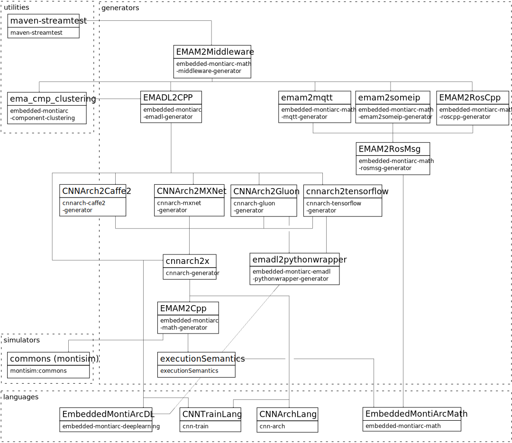

<br/><br/>
<div align="center">
    <a href="https://monticore.pages.rwth-aachen.de/EmbeddedMontiArc/utilities/emadl-maven-plugin/index.html">
        
    </a>
</div>
<br/><br/>

<hr/>

<div align="center">
    [**Documentation**](https://monticore.pages.rwth-aachen.de/EmbeddedMontiArc/utilities/emadl-maven-plugin) 
    <b>|</b>
    <a href="https://git.rwth-aachen.de/monticore/EmbeddedMontiArc/utilities/emadl-maven-plugin/-/pipelines/latest">
        
    </a>
</div>

<hr/>
<br/>


<br/>

## Note for devs
When you change the version of the maven-streamtest dependency, please also update it in the [training mojo](https://git.rwth-aachen.de/monticore/EmbeddedMontiArc/utilities/emadl-maven-plugin/-/blob/master/src/main/java/de/monticore/lang/monticar/utilities/mojos/TrainingMojo.java)!

## Describtion
The **EMADL Maven Plugin** provides custom goals to package and deploy or install various aspects of an **E**mbedded**M**onti**A**rc 
**D**eep **L**earning project as a JAR file. The files that can be packaged and deployed are:
- Datasets
- EMADL components + training configurations
- Pre-trained neural networks
- Training results (trained neural network + generated C++ components)
- Training environment (EMADL components + training configurations + datasets)

For each of them, a custom *deploy* and a custom *install* goal is available. The configurations of each goal can be specified in the *pom.xml*
file.  A list of all available goals and the their configuration parameters can be found in 
the [Documentation](https://monticore.pages.rwth-aachen.de/EmbeddedMontiArc/utilities/emadl-maven-plugin/plugin-info.html) page.<br/>
To invoke a goal of the *emadl-maven-plugin*, the prefix **emadl** can be used. For example, the command
```Python
mvn emadl:deploy-dataset
```
invokes the *deploy-dataset* goal of the *emadl-maven-plugin*. </br>
Additonally to the *deploy* and *install* goals, two more goals are available.
The first goal, called *train*, trains an EMADL component that contains a neural network implementation and generates the corresponding 
C++ components. The second goal is called *import* and unpacks a JAR containing EMADL components and training configurations to the local
project such that they can be reused.


## Examples 
Some examples of how to define the configurations for a certain goal can be found in the [Wiki](https://git.rwth-aachen.de/monticore/EmbeddedMontiArc/utilities/emadl-maven-plugin/-/wikis/Configuration-Eamples) page.

Further examples can be found in the [MNISTCalculator](https://git.rwth-aachen.de/monticore/EmbeddedMontiArc/applications/mnistcalculator) and [BERTSentimentAnalyzer ](https://git.rwth-aachen.de/monticore/EmbeddedMontiArc/applications/bertsentimentanalyzer) evaluation projects. 

## Dependency Graph of this project


