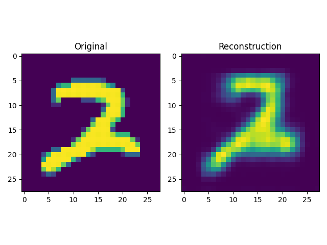
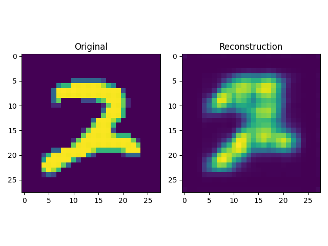

# VQ-VAEs
Vector-Quantized Variational Autoencoders are discrete variants of the VAEs.
Instead of a distribution of the latent codes the model learns a codebook using
the `VectorQuantized`-Layer.

However, VQ-VAEs can not simply sample the codes from this codebook to generate new images.
They need to be appropriately composed. For that reason,
the generation of new images using VQ-VAEs are dependent on an additional model that learns probability distributions of
feature map pixels from which we can take a sample and quantize them using the learned codebook.
The probability model can be an autoregressive generative model such as PixelCNNs, which is not utilized in this project.

This EMADL project contains the trainable neural network model of a VQ-VAE.

## How to Run
Generate code, train and build the EMADL model by executing:

```
bash build.sh
```
## Note regarding pre-trained parameters
The parameters came from a model that was trained for 100 epochs. However, the minimum is at epoch 78. Due to the difference in reconstruction performance, the file model-0-newest-0000.params usually featuring parameters of epoch 99 were replaced with the model from epoch 78. Loss graph as well as reconstruction images during training can be found in the pre-trained folder.

Left image: Epoch 78; Right image: Epoch 99.





## Issues
The trained model does not work in C++, but the parameters can be loaded and used in Python. We can use the reconstruction tests in `src/test/test_pre-trained` as a reference point regarding this issue.
The Python test successfully reconstructs the input images. The C++ application doesn't produce any reconstructions.
The latent codes were also compared to each other. While the latent code in the python clearly shows the computed features, the encodings in the CPP application seem rather meaningless.
It seems like the functionality of the encoder is different in the C++ language bindings than in the MXNet Python bindings.
The root of this problem was not found yet and will require further investigations. 